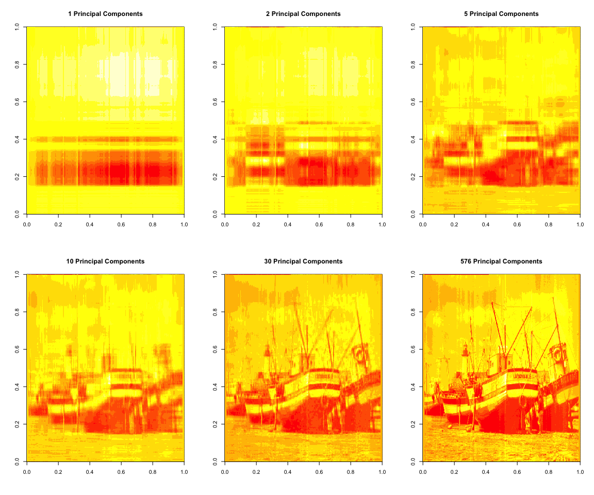
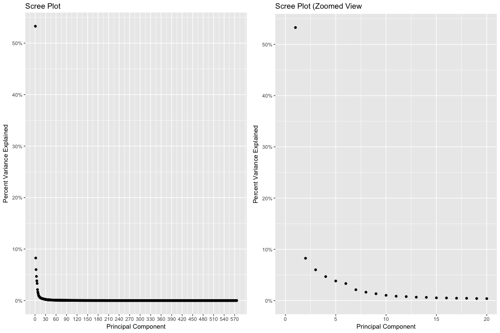
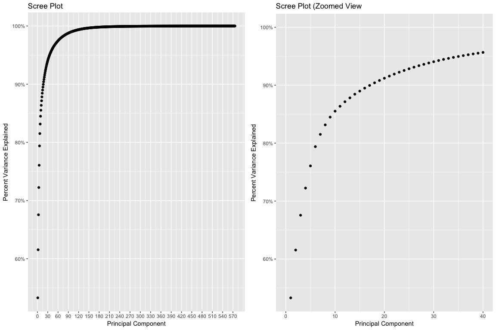

A Practical Introductory Tutorial on Principal Component Analysis
================
Henry Castellanos

### *This is an example of an R Markdown document I wrote to help myself understand Principal Component Analysis. Eventually, I began using documents like this as the basis (i.e. training material) for helping consulting practitioners at the various firms i've worked for learn basic machine learning. While in grad school I took a particular interest in multivariate analysis (unsupervised learning) methods once I understood the importance of exploratory data analysis in supervised / econometric / modelling exercises, etc.*

**Data Mining with Principal Component Analysis**
=================================================

Data Mining is, "the nontrivial extraction of implicit, previously unknown and potentially useful information from data." **(An Introduction to Applied Multivariate Analysis,1)** Principal component analysis (PCA) is one of the most fundamental, sophisticated data mining techniques that has many applications (and implications) in analysis. In fact, many texts on data mining begin with an explanation of principal component analysis.

In terms of machine learning, PCA falls under the category of unsupervised learning since there is no explicit target variable or dependent variable that is central to the analysis itself. Rather, the goal of PCA, much like related methods for multivariate analysis of data, is to attempt to detect "possibly unanticipated patterns in the data, opening up a wide range of competing explanations. Such methods are generally characterised both by an emphasis on the importance of graphical displays and visualisation of the data and the lack of any associated probabilistic model that would allow for formal inferences." **(An Introduction to Applied Multivariate Analysis,2)**

Furthermore, because results are easy to interpret and the algorithm is relatively easy to understand computationally, it's a very popular and useful technique to leverage in **explanatory data analysis.**

**How is PCA useful?**
----------------------

In a strictly applied sense, PCA is useful for figuring out which variables in a data set are the most important, or which variable(s) account for most of the variation (variance) in the data. **Note that we are implying that variance is a proxy for information.** Assuming there is more signal than noise in the data, a relatively harmless assumption in most data, we can employ PCA to help us identify which variables contain the most explanatory power or information. In so doing we can discover dynamics (i.e. multivariate relationships in the data) as well as hidden structure (i.e. latent variables) in the data.

Even though PCA is an unsupervised learning technique, it is useful for dealing with modeling problems such as multicollinearity and over-fitting making it particularly helpful when estimating predictive models.

PCA helps make these kinds of inferences **by reducing the dimensionality of the data OR combining / condensing variables into a fewer number of variables or columns called principal components (PC's).** Dimensionality reduction refers to the transformation of an underlying data frame into an equivalent data frame with **fewer number of columns.**

Put another way, PCA helps us capture as much information (up to and including 100% of the variance or information) in the data in fewer number of variables or columns.

In summary, PCA provides the following benefits by capturing the variance in the data in fewer number of columns:

1.  Rank-order variables in terms of relative importance or variance explained
2.  Visualize high-dimensional data in two dimensions
3.  Deal with statistical problems such as multicollinearity
4.  Filter noise from the data to avoid over-fitting predictive models

In the following 3 sections, we are going to see these benefits materialize through practical applications of principal component analysis. **We start with a motivating example** to build some intuition behind the fundamental mechanism in PCA.

**Motivation : Reconstructing an image using Principle Components**
-------------------------------------------------------------------


**What exactly does it mean to capture the most information possible in fewer number of columns?**

(Note: We refer to columns as variables and variables as columns interchangeably. In general, columns of data are referred to as variables for statistical analysis. In this specific example, it's more intuitive to refer to columns than variables since each column of data isn't necessarily a variable in any analytical sense but rather literally another column of pixel data.)

One way to see the intuition behind the above statement is to use PCA to reconstruct an image using the derived principal components.

Leveraging some toolboxes available in Matlab, we can decompose the above image into a table of pixel data, where each column contains the underlying pixels for the above image from left to right. Thus, the pixels that make up the left-most part of the above image are stored in the first column, etc.

The complete data set of pixels has **576 rows and 720 columns.** In other words, it takes 720 columns of pixel data, such as is shown in the data sample below, to render the above image.

|     data.1|     data.2|     data.3|      data.4|      data.5|      data.6|     data.7|      data.8|       data.9|      data.10|      data.11|      data.12|      data.13|      data.14|       data.15|      data.16|     data.17|     data.18|      data.19|      data.20|      data.21|      data.22|      data.23|      data.24|      data.25|      data.26|      data.27|      data.28|      data.29|      data.30|      data.31|      data.32|      data.33|      data.34|      data.35|      data.36|     data.37|      data.38|     data.39|     data.40|      data.41|     data.42|     data.43|     data.44|     data.45|     data.46|  data.47|      data.48|     data.49|     data.50|     data.51|    data.52|     data.53|     data.54|     data.55|     data.56|     data.57|     data.58|     data.59|     data.60|     data.61|     data.62|     data.63|     data.64|     data.65|     data.66|     data.67|     data.68|     data.69|    data.70|     data.71|     data.72|     data.73|     data.74|     data.75|     data.76|     data.77|     data.78|     data.79|     data.80|     data.81|     data.82|     data.83|     data.84|     data.85|     data.86|     data.87|     data.88|     data.89|     data.90|     data.91|     data.92|     data.93|     data.94|     data.95|     data.96|     data.97|     data.98|    data.99|    data.100|    data.101|    data.102|    data.103|    data.104|   data.105|    data.106|    data.107|    data.108|    data.109|    data.110|    data.111|    data.112|    data.113|    data.114|    data.115|    data.116|    data.117|    data.118|    data.119|    data.120|    data.121|    data.122|    data.123|    data.124|    data.125|    data.126|  data.127|    data.128|    data.129|    data.130|  data.131|    data.132|    data.133|    data.134|    data.135|    data.136|    data.137|    data.138|   data.139|    data.140|    data.141|    data.142|    data.143|    data.144|    data.145|    data.146|    data.147|    data.148|    data.149|    data.150|  data.151|    data.152|    data.153|    data.154|    data.155|    data.156|    data.157|    data.158|    data.159|    data.160|    data.161|    data.162|    data.163|    data.164|    data.165|    data.166|   data.167|    data.168|    data.169|    data.170|   data.171|    data.172|    data.173|    data.174|    data.175|    data.176|    data.177|    data.178|   data.179|   data.180|    data.181|    data.182|    data.183|    data.184|    data.185|   data.186|    data.187|    data.188|    data.189|    data.190|    data.191|    data.192|    data.193|    data.194|   data.195|    data.196|    data.197|    data.198|    data.199|    data.200|    data.201|    data.202|    data.203|    data.204|    data.205|    data.206|    data.207|    data.208|    data.209|    data.210|    data.211|    data.212|  data.213|    data.214|    data.215|    data.216|    data.217|    data.218|    data.219|    data.220|    data.221|    data.222|    data.223|    data.224|    data.225|  data.226|    data.227|    data.228|    data.229|    data.230|    data.231|    data.232|    data.233|    data.234|    data.235|   data.236|    data.237|    data.238|    data.239|    data.240|    data.241|    data.242|    data.243|   data.244|    data.245|    data.246|    data.247|    data.248|    data.249|    data.250|    data.251|    data.252|    data.253|    data.254|    data.255|    data.256|    data.257|    data.258|    data.259|    data.260|    data.261|    data.262|    data.263|    data.264|    data.265|    data.266|    data.267|    data.268|    data.269|    data.270|    data.271|    data.272|    data.273|    data.274|    data.275|    data.276|    data.277|    data.278|    data.279|  data.280|    data.281|    data.282|    data.283|    data.284|    data.285|    data.286|    data.287|    data.288|    data.289|    data.290|    data.291|    data.292|    data.293|    data.294|    data.295|    data.296|    data.297|    data.298|    data.299|    data.300|    data.301|    data.302|    data.303|   data.304|  data.305|  data.306|  data.307|  data.308|  data.309|  data.310|  data.311|  data.312|  data.313|  data.314|  data.315|  data.316|  data.317|  data.318|  data.319|  data.320|  data.321|  data.322|  data.323|  data.324|  data.325|  data.326|  data.327|  data.328|  data.329|  data.330|  data.331|  data.332|  data.333|  data.334|  data.335|  data.336|  data.337|  data.338|  data.339|  data.340|  data.341|  data.342|  data.343|  data.344|  data.345|  data.346|  data.347|  data.348|  data.349|  data.350|  data.351|  data.352|  data.353|  data.354|  data.355|  data.356|  data.357|  data.358|  data.359|   data.360|   data.361|   data.362|  data.363|  data.364|  data.365|  data.366|  data.367|  data.368|  data.369|  data.370|  data.371|  data.372|   data.373|  data.374|  data.375|  data.376|  data.377|  data.378|  data.379|  data.380|  data.381|  data.382|  data.383|  data.384|  data.385|  data.386|  data.387|  data.388|  data.389|  data.390|  data.391|  data.392|  data.393|  data.394|  data.395|  data.396|  data.397|  data.398|  data.399|  data.400|  data.401|  data.402|  data.403|  data.404|  data.405|  data.406|  data.407|  data.408|  data.409|  data.410|  data.411|  data.412|  data.413|  data.414|  data.415|  data.416|  data.417|  data.418|  data.419|  data.420|  data.421|  data.422|  data.423|  data.424|  data.425|  data.426|  data.427|  data.428|  data.429|  data.430|  data.431|  data.432|  data.433|  data.434|  data.435|  data.436|  data.437|  data.438|   data.439|   data.440|  data.441|  data.442|  data.443|  data.444|  data.445|  data.446|  data.447|  data.448|  data.449|  data.450|   data.451|  data.452|  data.453|  data.454|  data.455|  data.456|  data.457|  data.458|  data.459|  data.460|  data.461|  data.462|  data.463|  data.464|  data.465|  data.466|  data.467|  data.468|  data.469|   data.470|  data.471|  data.472|   data.473|   data.474|   data.475|  data.476|   data.477|  data.478|  data.479|   data.480|  data.481|   data.482|  data.483|  data.484|   data.485|  data.486|  data.487|   data.488|  data.489|  data.490|  data.491|  data.492|  data.493|  data.494|  data.495|  data.496|  data.497|  data.498|  data.499|  data.500|  data.501|  data.502|   data.503|  data.504|   data.505|   data.506|   data.507|   data.508|   data.509|  data.510|   data.511|   data.512|   data.513|  data.514|   data.515|  data.516|  data.517|  data.518|  data.519|   data.520|   data.521|  data.522|  data.523|  data.524|  data.525|  data.526|   data.527|  data.528|  data.529|   data.530|  data.531|  data.532|  data.533|   data.534|  data.535|   data.536|  data.537|  data.538|  data.539|  data.540|  data.541|   data.542|   data.543|  data.544|   data.545|   data.546|  data.547|  data.548|  data.549|  data.550|  data.551|   data.552|   data.553|   data.554|   data.555|   data.556|  data.557|   data.558|   data.559|   data.560|  data.561|  data.562|  data.563|  data.564|  data.565|  data.566|   data.567|   data.568|   data.569|   data.570|   data.571|   data.572|   data.573|   data.574|   data.575|   data.576|   data.577|   data.578|   data.579|   data.580|   data.581|   data.582|   data.583|   data.584|   data.585|   data.586|   data.587|   data.588|  data.589|  data.590|   data.591|  data.592|  data.593|  data.594|  data.595|  data.596|  data.597|  data.598|  data.599|  data.600|  data.601|  data.602|  data.603|  data.604|  data.605|  data.606|  data.607|  data.608|  data.609|  data.610|  data.611|  data.612|  data.613|  data.614|  data.615|  data.616|  data.617|  data.618|  data.619|  data.620|  data.621|  data.622|  data.623|  data.624|  data.625|  data.626|  data.627|  data.628|  data.629|  data.630|  data.631|  data.632|  data.633|  data.634|  data.635|  data.636|  data.637|  data.638|  data.639|  data.640|  data.641|  data.642|  data.643|  data.644|  data.645|  data.646|  data.647|  data.648|  data.649|  data.650|  data.651|  data.652|  data.653|  data.654|  data.655|  data.656|  data.657|  data.658|  data.659|  data.660|  data.661|  data.662|  data.663|  data.664|  data.665|  data.666|  data.667|  data.668|   data.669|  data.670|  data.671|  data.672|  data.673|  data.674|  data.675|  data.676|  data.677|  data.678|  data.679|  data.680|  data.681|  data.682|  data.683|  data.684|  data.685|  data.686|   data.687|  data.688|   data.689|   data.690|   data.691|   data.692|   data.693|   data.694|   data.695|   data.696|   data.697|   data.698|   data.699|   data.700|   data.701|   data.702|   data.703|   data.704|  data.705|   data.706|  data.707|  data.708|  data.709|  data.710|  data.711|  data.712|  data.713|  data.714|    data.715|   data.716|    data.717|  data.718|    data.719|    data.720|
|----------:|----------:|----------:|-----------:|-----------:|-----------:|----------:|-----------:|------------:|------------:|------------:|------------:|------------:|------------:|-------------:|------------:|-----------:|-----------:|------------:|------------:|------------:|------------:|------------:|------------:|------------:|------------:|------------:|------------:|------------:|------------:|------------:|------------:|------------:|------------:|------------:|------------:|-----------:|------------:|-----------:|-----------:|------------:|-----------:|-----------:|-----------:|-----------:|-----------:|--------:|------------:|-----------:|-----------:|-----------:|----------:|-----------:|-----------:|-----------:|-----------:|-----------:|-----------:|-----------:|-----------:|-----------:|-----------:|-----------:|-----------:|-----------:|-----------:|-----------:|-----------:|-----------:|----------:|-----------:|-----------:|-----------:|-----------:|-----------:|-----------:|-----------:|-----------:|-----------:|-----------:|-----------:|-----------:|-----------:|-----------:|-----------:|-----------:|-----------:|-----------:|-----------:|-----------:|-----------:|-----------:|-----------:|-----------:|-----------:|-----------:|-----------:|-----------:|----------:|-----------:|-----------:|-----------:|-----------:|-----------:|----------:|-----------:|-----------:|-----------:|-----------:|-----------:|-----------:|-----------:|-----------:|-----------:|-----------:|-----------:|-----------:|-----------:|-----------:|-----------:|-----------:|-----------:|-----------:|-----------:|-----------:|-----------:|---------:|-----------:|-----------:|-----------:|---------:|-----------:|-----------:|-----------:|-----------:|-----------:|-----------:|-----------:|----------:|-----------:|-----------:|-----------:|-----------:|-----------:|-----------:|-----------:|-----------:|-----------:|-----------:|-----------:|---------:|-----------:|-----------:|-----------:|-----------:|-----------:|-----------:|-----------:|-----------:|-----------:|-----------:|-----------:|-----------:|-----------:|-----------:|-----------:|----------:|-----------:|-----------:|-----------:|----------:|-----------:|-----------:|-----------:|-----------:|-----------:|-----------:|-----------:|----------:|----------:|-----------:|-----------:|-----------:|-----------:|-----------:|----------:|-----------:|-----------:|-----------:|-----------:|-----------:|-----------:|-----------:|-----------:|----------:|-----------:|-----------:|-----------:|-----------:|-----------:|-----------:|-----------:|-----------:|-----------:|-----------:|-----------:|-----------:|-----------:|-----------:|-----------:|-----------:|-----------:|---------:|-----------:|-----------:|-----------:|-----------:|-----------:|-----------:|-----------:|-----------:|-----------:|-----------:|-----------:|-----------:|---------:|-----------:|-----------:|-----------:|-----------:|-----------:|-----------:|-----------:|-----------:|-----------:|----------:|-----------:|-----------:|-----------:|-----------:|-----------:|-----------:|-----------:|----------:|-----------:|-----------:|-----------:|-----------:|-----------:|-----------:|-----------:|-----------:|-----------:|-----------:|-----------:|-----------:|-----------:|-----------:|-----------:|-----------:|-----------:|-----------:|-----------:|-----------:|-----------:|-----------:|-----------:|-----------:|-----------:|-----------:|-----------:|-----------:|-----------:|-----------:|-----------:|-----------:|-----------:|-----------:|-----------:|---------:|-----------:|-----------:|-----------:|-----------:|-----------:|-----------:|-----------:|-----------:|-----------:|-----------:|-----------:|-----------:|-----------:|-----------:|-----------:|-----------:|-----------:|-----------:|-----------:|-----------:|-----------:|-----------:|-----------:|----------:|---------:|---------:|---------:|---------:|---------:|---------:|---------:|---------:|---------:|---------:|---------:|---------:|---------:|---------:|---------:|---------:|---------:|---------:|---------:|---------:|---------:|---------:|---------:|---------:|---------:|---------:|---------:|---------:|---------:|---------:|---------:|---------:|---------:|---------:|---------:|---------:|---------:|---------:|---------:|---------:|---------:|---------:|---------:|---------:|---------:|---------:|---------:|---------:|---------:|---------:|---------:|---------:|---------:|---------:|---------:|----------:|----------:|----------:|---------:|---------:|---------:|---------:|---------:|---------:|---------:|---------:|---------:|---------:|----------:|---------:|---------:|---------:|---------:|---------:|---------:|---------:|---------:|---------:|---------:|---------:|---------:|---------:|---------:|---------:|---------:|---------:|---------:|---------:|---------:|---------:|---------:|---------:|---------:|---------:|---------:|---------:|---------:|---------:|---------:|---------:|---------:|---------:|---------:|---------:|---------:|---------:|---------:|---------:|---------:|---------:|---------:|---------:|---------:|---------:|---------:|---------:|---------:|---------:|---------:|---------:|---------:|---------:|---------:|---------:|---------:|---------:|---------:|---------:|---------:|---------:|---------:|---------:|---------:|---------:|----------:|----------:|---------:|---------:|---------:|---------:|---------:|---------:|---------:|---------:|---------:|---------:|----------:|---------:|---------:|---------:|---------:|---------:|---------:|---------:|---------:|---------:|---------:|---------:|---------:|---------:|---------:|---------:|---------:|---------:|---------:|----------:|---------:|---------:|----------:|----------:|----------:|---------:|----------:|---------:|---------:|----------:|---------:|----------:|---------:|---------:|----------:|---------:|---------:|----------:|---------:|---------:|---------:|---------:|---------:|---------:|---------:|---------:|---------:|---------:|---------:|---------:|---------:|---------:|----------:|---------:|----------:|----------:|----------:|----------:|----------:|---------:|----------:|----------:|----------:|---------:|----------:|---------:|---------:|---------:|---------:|----------:|----------:|---------:|---------:|---------:|---------:|---------:|----------:|---------:|---------:|----------:|---------:|---------:|---------:|----------:|---------:|----------:|---------:|---------:|---------:|---------:|---------:|----------:|----------:|---------:|----------:|----------:|---------:|---------:|---------:|---------:|---------:|----------:|----------:|----------:|----------:|----------:|---------:|----------:|----------:|----------:|---------:|---------:|---------:|---------:|---------:|---------:|----------:|----------:|----------:|----------:|----------:|----------:|----------:|----------:|----------:|----------:|----------:|----------:|----------:|----------:|----------:|----------:|----------:|----------:|----------:|----------:|----------:|----------:|---------:|---------:|----------:|---------:|---------:|---------:|---------:|---------:|---------:|---------:|---------:|---------:|---------:|---------:|---------:|---------:|---------:|---------:|---------:|---------:|---------:|---------:|---------:|---------:|---------:|---------:|---------:|---------:|---------:|---------:|---------:|---------:|---------:|---------:|---------:|---------:|---------:|---------:|---------:|---------:|---------:|---------:|---------:|---------:|---------:|---------:|---------:|---------:|---------:|---------:|---------:|---------:|---------:|---------:|---------:|---------:|---------:|---------:|---------:|---------:|---------:|---------:|---------:|---------:|---------:|---------:|---------:|---------:|---------:|---------:|---------:|---------:|---------:|---------:|---------:|---------:|---------:|---------:|---------:|---------:|----------:|---------:|---------:|---------:|---------:|---------:|---------:|---------:|---------:|---------:|---------:|---------:|---------:|---------:|---------:|---------:|---------:|---------:|----------:|---------:|----------:|----------:|----------:|----------:|----------:|----------:|----------:|----------:|----------:|----------:|----------:|----------:|----------:|----------:|----------:|----------:|---------:|----------:|---------:|---------:|---------:|---------:|---------:|---------:|---------:|---------:|-----------:|----------:|-----------:|---------:|-----------:|-----------:|
|  1.2083333|  1.1597222|  0.3802083|  -0.3454861|   1.8211806|  -1.6649306|  2.4288194|  -17.151042|  -61.7309028|  -83.1579861|  -97.4670139|  -103.373264|  -108.611111|  -114.711806|  -117.9496528|  -115.024306|  -114.09375|  -115.02431|  -117.654514|  -122.467014|  -122.284722|  -122.519097|  -123.550347|  -124.539931|  -125.678819|  -126.114583|  -125.923611|  -126.144097|  -127.041667|  -127.505208|  -128.223958|  -128.151042|  -128.309028|  -128.848958|  -129.401042|  -129.032986|  -129.40625|  -129.338542|  -129.68403|  -128.90625|  -129.897569|  -127.97743|  -126.58681|  -127.17708|  -126.18056|  -125.85069|  -123.75|  -123.072917|  -122.44271|  -122.41146|  -122.44618|  -121.9375|  -123.24653|  -122.10243|  -122.52778|  -124.56944|  -124.11111|  -123.78125|  -121.97222|  -121.13715|  -119.30903|  -116.27778|  -117.70833|  -118.93229|  -119.05903|  -116.74306|  -119.13368|  -119.53819|  -118.32118|  -118.2934|  -117.55035|  -115.98958|  -114.83333|  -115.60243|  -117.34028|  -116.24826|  -117.57812|  -118.69271|  -118.55035|  -119.68056|  -121.32465|  -121.48438|  -120.98611|  -121.47569|  -122.02431|  -123.02778|  -123.15278|  -121.97917|  -122.57986|  -122.17014|  -121.76042|  -121.61285|  -121.96528|  -123.21875|  -124.67708|  -127.21528|  -129.53993|  -130.05729|  -129.7066|  -129.72743|  -130.19271|  -129.89757|  -130.28646|  -130.84896|  -130.0625|  -130.51736|  -129.55382|  -129.14236|  -130.13715|  -130.98438|  -130.15625|  -129.81076|  -128.85764|  -129.20139|  -129.60069|  -128.93056|  -130.79167|  -129.40451|  -126.09028|  -126.45312|  -126.53993|  -126.80903|  -126.97049|  -127.55035|  -128.43403|  -128.42708|      -128|  -126.15625|  -125.32639|  -125.56597|      -125|  -124.18576|  -123.79514|  -124.92708|  -126.59722|  -126.03299|  -125.88715|  -127.29514|  -125.8559|  -126.43229|  -126.05903|  -125.34896|  -126.10938|  -126.88889|  -126.15451|  -125.73958|  -127.43056|  -126.55556|  -126.17014|  -127.38021|      -126|  -126.86111|  -126.51562|  -124.08507|  -124.41493|  -122.79861|  -118.71701|  -120.84028|  -122.85764|  -122.32986|  -122.48264|  -122.38715|  -122.79688|  -122.52431|  -124.07292|  -123.90972|  -127.6441|  -128.06597|  -126.42188|  -122.97396|  -118.5816|  -120.03125|  -120.53472|  -120.63715|  -122.36979|  -122.18576|  -121.40278|  -118.77778|  -120.0625|  -124.7934|  -125.88542|  -125.61632|  -123.62847|  -124.37153|  -122.82118|  -122.5191|  -123.85069|  -124.03299|  -123.95486|  -122.32465|  -121.14757|  -119.51736|  -119.81597|  -118.57292|  -117.2066|  -116.55556|  -115.76042|  -115.86111|  -116.50521|  -115.68924|  -115.65625|  -115.83681|  -114.50174|  -115.62326|  -116.04167|  -118.44444|  -123.60243|  -125.22396|  -123.74132|  -124.50694|  -126.64583|  -124.76389|    -124.5|  -124.19792|  -121.82118|  -122.14062|  -122.33681|  -119.18229|  -114.59201|  -117.04861|  -118.19618|  -120.14757|  -123.57292|  -125.72917|  -125.97396|  -125.125|  -122.86806|  -123.76389|  -125.94618|  -130.36632|  -131.52604|  -127.69965|  -125.96875|  -124.79861|  -118.13368|  -114.2934|  -113.87326|  -113.36458|  -114.01389|  -114.10069|  -114.28472|  -115.38368|  -116.47396|  -119.0434|  -119.86979|  -120.45833|  -121.30729|  -121.94792|  -121.59375|  -121.71875|  -121.82639|  -121.89931|  -121.68576|  -120.47222|  -119.37326|  -119.62153|  -118.64062|  -118.28646|  -116.66146|  -116.32639|  -116.74653|  -116.99132|  -118.56076|  -119.27604|  -119.58854|  -117.96354|  -118.86111|  -118.34028|  -116.58333|  -116.49653|  -117.89236|  -119.25521|  -122.01389|  -122.80208|  -122.38542|  -122.38194|  -125.32639|  -123.31771|  -124.75694|  -124.125|  -122.41146|  -125.88889|  -126.97917|  -128.38368|  -126.90278|  -127.84722|  -128.15278|  -127.82292|  -127.23438|  -128.16146|  -128.29167|  -126.66667|  -125.77604|  -125.13021|  -124.37847|  -125.92535|  -124.19271|  -128.02431|  -128.42361|  -125.32639|  -123.47569|  -121.74306|  -126.67188|   1.710069|  42.55382|  18.92708|  29.55382|   27.3316|  28.63542|  28.38021|  26.92361|  31.32118|  33.20833|  30.25347|  26.70312|   28.3125|  33.53646|  25.12847|  19.70486|  16.48611|   17.1441|  15.48264|  17.30903|  16.91667|  17.32118|  20.22396|  18.20486|  21.46701|  19.28819|  17.74826|  23.67708|  21.18056|  22.42882|  23.40625|  23.88715|  24.61806|  29.24826|  26.17882|  27.03993|  33.79167|  29.58333|  32.80903|  28.52951|  31.27951|  30.40451|  24.74479|  26.41667|  23.53125|  17.77257|  20.53646|  21.38715|  19.57812|  21.80208|  22.04167|  21.82465|  16.19271|  15.62153|  15.66667|  17.68576|  10.633681|  13.630208|  15.675347|   14.0625|      13.5|  20.17708|  49.19965|  27.90972|  5.857639|  17.65278|  13.87153|  10.94097|  16.80729|  15.803819|    18.625|   28.0434|   33.1059|  34.19444|  34.90972|  32.88194|  27.71354|  18.29688|  15.52257|  18.06771|  19.68576|  18.06597|  19.68576|  21.73785|  20.76736|  16.50868|  20.24479|  22.65104|  22.48958|  24.41319|  21.28299|  25.24653|  22.81771|  23.91667|  24.94965|  20.68056|  21.00347|  16.31944|  20.63368|  18.10069|  20.84375|  18.42361|  19.14583|  23.42708|  14.15799|  18.90799|   19.5625|  15.78993|  20.69097|  14.92014|  14.52951|  13.99306|  17.36458|  18.12153|  15.45486|  17.68403|  15.12326|  13.42708|  14.65451|  16.87326|  15.23785|  16.49479|  15.03299|  17.19792|  16.57812|  14.31944|  16.73264|  15.50347|  18.36979|  18.41319|   17.7066|  16.10243|  20.29167|  17.63368|  18.02604|  15.710069|  17.939236|  13.15799|  13.65278|  17.80903|  16.69965|  17.42708|   16.6875|  17.92708|  17.80903|  14.30556|  17.69965|  14.210069|  11.31424|  20.67188|  21.61806|  18.07812|  23.43403|  17.62847|  22.59201|  20.68576|  20.06771|  22.22743|  16.35764|  19.90451|  19.88889|  17.88542|  17.90278|  15.23611|  13.61632|  11.26042|  10.373264|  12.20139|  13.56597|  13.611111|  14.413194|  14.621528|  17.05903|  15.539931|  12.24826|  15.25868|  11.791667|  12.17535|  10.644097|  12.45312|  12.03993|  13.973958|  10.53819|  12.44444|   9.939236|  11.49826|  14.79167|  13.82812|  10.57465|  12.08333|  12.00521|  14.35069|     17.75|  23.27778|  27.01215|  25.82465|  20.85938|  16.19618|  11.18924|  10.149306|  17.06076|   9.748264|  12.003472|   9.171875|  13.149306|  14.300347|    9.6875|  10.517361|   8.345486|  10.697917|   6.03125|  11.428819|  5.196181|  6.866319|  7.491319|  5.690972|  4.1545139|   3.977431|  2.348958|  3.491319|  7.447917|  1.246528|  6.020833|   9.006944|  5.142361|  3.463542|  0.3211806|  4.706597|  4.220486|  4.222222|  3.9791667|  0.109375|  3.5190972|  3.727431|  5.611111|  5.630208|         4|  8.623264|   9.137153|  14.515625|  10.29514|   9.916667|  13.661458|  10.82986|  19.23438|  12.68924|  13.80035|  14.92361|  10.302083|  11.989583|   8.626736|  11.515625|   9.890625|  7.996528|   8.322917|   8.729167|  11.010417|  6.921875|  7.989583|  10.53125|  13.04861|  15.15799|  12.74826|  10.362847|  14.012153|   7.763889|  11.630208|  11.019097|  10.951389|  11.756944|  11.427083|  10.210069|  10.338542|   9.366319|   7.592014|   9.272569|   8.512153|   7.574653|  12.376736|  11.171875|  12.517361|  13.286458|   9.590278|  11.909722|  15.661458|  13.07639|  13.90278|  13.993056|  13.05556|  15.82639|  18.03472|  17.50521|  22.11458|  20.52604|  18.26215|  25.77951|   23.5816|  30.23611|  26.95139|  30.36632|  31.58507|  30.19792|  32.27257|   27.7309|  33.96181|  27.97049|  31.04167|  30.89757|  29.50868|  26.84896|  28.70139|  24.77778|  25.00347|  21.99132|  24.11458|   27.8559|  22.63021|  26.47222|  29.78993|  26.20139|  31.59896|  29.53299|  25.56597|  29.57465|  26.69097|  23.81944|  26.37674|  26.64583|  24.34549|  25.53125|   28.6441|  26.71007|  28.48438|  22.83507|  29.64931|  25.73611|  27.21701|  28.65451|  25.59375|  25.16146|  28.64236|  30.01215|  27.20139|   30.2934|  27.46875|  28.73785|  29.53646|  26.13542|  27.91667|    25.625|  26.26215|  26.55382|    25.625|  25.19965|  22.67188|  27.34896|  21.72396|  20.40625|  23.33333|  19.32118|  19.03819|  18.97569|  14.10938|  16.14931|  14.94792|  16.319444|  14.41146|  14.21875|  15.27778|  13.31424|  14.73611|  16.80208|  17.78472|  17.76042|  20.21701|  17.30382|  16.65278|  14.11632|  15.12847|  18.41146|  17.27778|  14.78125|  13.05035|  10.800347|   12.5625|   8.041667|   9.670139|  11.055556|  10.595486|  10.428819|  14.644097|   7.501736|   9.607639|  11.934028|  13.300347|   8.684028|  14.272569|   8.284722|  10.682292|  10.572917|  12.065972|  15.19792|  10.821181|  13.83854|  16.65451|  12.88021|  15.51389|  15.51042|  4.519097|   -1.4375|       0.5|  -0.7881944|  0.3263889|   0.6111111|   0.28125|  -0.1232639|  -0.3038194|
|  1.2083333|  1.1597222|  0.3802083|   0.6545139|   0.8211806|   0.3350694|  0.4288194|   -4.151042|    0.2690972|    1.8420139|    6.5329861|     6.626736|     4.388889|     6.288194|    11.0503472|    12.975694|    15.90625|    18.97569|    13.345486|    12.532986|    10.715278|    11.480903|    14.449653|    11.460069|    12.321181|    11.885417|    14.076389|     9.855903|    10.958333|    13.494792|    10.776042|    14.848958|     8.690972|    13.151042|     9.598958|    10.967014|    12.59375|    13.661458|    11.31597|     8.09375|    10.102431|    11.02257|    15.41319|    13.82292|    18.81944|    14.14931|    16.25|    18.927083|    22.55729|    18.58854|    23.55382|    21.0625|    18.75347|    24.89757|    23.47222|    16.43056|    20.88889|    20.21875|    23.02778|    29.86285|    22.69097|    29.72222|    29.29167|    25.06771|    27.94097|    28.25694|    27.86632|    26.46181|    25.67882|    26.7066|    23.44965|    27.01042|    32.16667|    32.39757|    27.65972|    27.75174|    29.42188|    25.30729|    26.44965|    22.31944|    16.67535|    21.51562|    20.01389|    15.52431|    19.97569|    15.97222|    15.84722|    17.02083|    21.42014|    21.82986|    23.23958|    30.38715|    29.03472|    26.78125|    32.32292|    23.78472|    22.46007|    22.94271|    23.2934|    25.27257|    22.80729|    24.10243|    23.71354|    22.15104|    23.9375|    23.48264|    24.44618|    24.85764|    24.86285|    25.01562|    23.84375|    27.18924|    27.14236|    28.79861|    25.39931|    28.06944|    27.20833|    24.59549|    32.90972|    29.54688|    30.46007|    28.19097|    29.02951|    27.44965|    31.56597|    28.57292|        29|    30.84375|    31.67361|    36.43403|        33|    31.81424|    35.20486|    33.07292|    31.40278|    33.96701|    31.11285|    31.70486|    33.1441|    32.56771|    31.94097|    34.65104|    30.89062|    33.11111|    31.84549|    30.26042|    29.56944|    30.44444|    29.82986|    30.61979|        32|    31.13889|    31.48438|    29.91493|    32.58507|    27.20139|    25.28299|    30.15972|    32.14236|    30.67014|    33.51736|    29.61285|    33.20312|    30.47569|    27.92708|    28.09028|    24.3559|    26.93403|    25.57812|    31.02604|    32.4184|    33.96875|    31.46528|    30.36285|    29.63021|    28.81424|    28.59722|    29.22222|    30.9375|    26.2066|    25.11458|    25.38368|    24.37153|    27.62847|    26.17882|    27.4809|    28.14931|    25.96701|    24.04514|    23.67535|    26.85243|    29.48264|    27.18403|    29.42708|    29.7934|    30.44444|    29.23958|    32.13889|    30.49479|    30.31076|    32.34375|    30.16319|    32.49826|    30.37674|    31.95833|    25.55556|    22.39757|    22.77604|    19.25868|    21.49306|    18.35417|    20.23611|      20.5|    24.80208|    24.17882|    21.85938|    24.66319|    27.81771|    31.40799|    26.95139|    28.80382|    23.85243|    23.42708|    20.27083|    18.02604|    22.875|    21.13194|    21.23611|    18.05382|    14.63368|    10.47396|    16.30035|    19.03125|    22.20139|    29.86632|    31.7066|    32.12674|    34.63542|    32.98611|    33.89931|    33.71528|    35.61632|    30.52604|    27.9566|    28.13021|    27.54167|    27.69271|    28.05208|    26.40625|    26.28125|    24.17361|    24.10069|    26.31424|    23.52778|    25.62674|    25.37847|    24.35938|    27.71354|    28.33854|    28.67361|    28.25347|    30.00868|    29.43924|    24.72396|    28.41146|    28.03646|    29.13889|    30.65972|    32.41667|    30.50347|    30.10764|    27.74479|    25.98611|    24.19792|    26.61458|    24.61806|    19.67361|    25.68229|    24.24306|    23.875|    26.58854|    23.11111|    21.02083|    22.61632|    19.09722|    22.15278|    21.84722|    23.17708|    21.76562|    21.83854|    24.70833|    23.33333|    27.22396|    26.86979|    26.62153|    28.07465|    26.80729|    25.97569|    23.57639|    26.67361|    27.52431|    26.25694|    24.32812|  28.710069|  21.55382|  19.92708|  19.55382|   18.3316|  19.63542|  15.38021|  18.92361|  23.32118|  23.20833|  21.25347|  15.70312|   18.3125|  20.53646|  19.12847|  18.70486|  16.48611|   16.1441|  17.48264|  18.30903|  17.91667|  18.32118|  19.22396|  22.20486|  20.46701|  21.28819|  19.74826|  19.67708|  22.18056|  16.42882|  23.40625|  22.88715|  25.61806|  30.24826|  27.17882|  28.03993|  32.79167|  30.58333|  31.80903|  31.52951|  30.27951|  29.40451|  28.74479|  26.41667|  24.53125|  23.77257|  21.53646|  21.38715|  21.57812|  19.80208|  23.04167|  18.82465|  15.19271|  18.62153|  15.66667|  15.68576|  10.633681|  13.630208|  11.675347|   13.0625|       9.5|  18.17708|  49.19965|  24.90972|  6.857639|  19.65278|  12.87153|  12.94097|  15.80729|  10.803819|    18.625|   25.0434|   31.1059|  34.19444|  33.90972|  32.88194|  28.71354|  20.29688|  15.52257|  19.06771|  20.68576|  18.06597|  17.68576|  20.73785|  22.76736|  19.50868|  22.24479|  21.65104|  21.48958|  22.41319|  22.28299|  22.24653|  25.81771|  20.91667|  20.94965|  22.68056|  18.00347|  21.31944|  18.63368|  18.10069|  20.84375|  18.42361|  19.14583|  19.42708|  19.15799|  17.90799|   17.5625|  19.78993|  19.69097|  13.92014|  15.52951|  13.99306|  18.36458|  18.12153|  15.45486|  17.68403|  13.12326|  15.42708|  14.65451|  15.87326|  18.23785|  13.49479|  16.03299|  19.19792|  13.57812|  16.31944|  14.73264|  19.50347|  19.36979|  16.41319|   19.7066|  15.10243|  19.29167|  18.63368|  16.02604|  16.710069|  16.939236|  15.15799|  14.65278|  18.80903|  13.69965|  18.42708|   18.6875|  16.92708|  20.80903|  14.30556|  15.69965|  13.210069|  10.31424|  20.67188|  22.61806|  16.07812|  19.43403|  22.62847|  18.59201|  20.68576|  18.06771|  20.22743|  19.35764|  19.90451|  19.88889|  15.88542|  15.90278|  15.23611|  13.61632|  14.26042|   8.373264|  15.20139|  13.56597|  11.611111|  14.413194|  11.621528|  16.05903|  13.539931|  12.24826|  11.25868|  12.791667|  13.17535|   7.644097|  11.45312|  13.03993|  10.973958|  11.53819|  12.44444|  13.939236|  11.49826|  15.79167|  10.82812|  11.57465|  13.08333|  12.00521|  13.35069|     18.75|  23.27778|  24.01215|  26.82465|  20.85938|  17.19618|  12.18924|   9.149306|  14.06076|  10.748264|  12.003472|  12.171875|   8.149306|  14.300347|   13.6875|   9.517361|  10.345486|   5.697917|   8.03125|   6.428819|  7.196181|  6.866319|  7.491319|  5.690972|  4.1545139|   1.977431|  5.348958|  3.491319|  5.447917|  5.246528|  7.020833|   5.006944|  5.142361|  4.463542|  0.3211806|  6.706597|  5.220486|  3.222222|  0.9791667|  3.109375|  2.5190972|  4.727431|  3.611111|  6.630208|        11|  9.623264|  12.137153|  10.515625|  16.29514|   8.916667|  13.661458|  14.82986|  14.23438|  15.68924|  14.80035|  14.92361|  10.302083|  11.989583|  12.626736|  10.515625|   8.890625|  5.996528|  10.322917|   8.729167|   6.010417|  7.921875|  9.989583|   9.53125|  15.04861|  15.15799|  16.74826|   9.362847|  10.012153|  11.763889|   6.630208|   7.019097|   9.951389|   7.756944|  11.427083|   9.210069|  11.338542|   9.366319|   7.592014|   8.272569|   8.512153|  10.574653|  13.376736|   9.171875|  14.517361|   9.286458|   8.590278|  13.909722|  14.661458|  13.07639|  13.90278|  12.993056|  13.05556|  15.82639|  15.03472|  22.50521|  23.11458|  23.52604|  21.26215|  23.77951|   25.5816|  25.23611|  28.95139|  31.36632|  27.58507|  33.19792|  29.27257|   28.7309|  32.96181|  27.97049|  32.04167|  28.89757|  26.50868|  27.84896|  23.70139|  26.77778|  24.00347|  23.99132|  24.11458|   24.8559|  27.63021|  23.47222|  27.78993|  28.20139|  27.59896|  29.53299|  29.56597|  23.57465|  25.69097|  23.81944|  28.37674|  26.64583|  24.34549|  29.53125|   25.6441|  28.71007|  25.48438|  28.83507|  27.64931|  29.73611|  26.21701|  28.65451|  27.59375|  25.16146|  30.64236|  27.01215|  28.20139|   29.2934|  28.46875|  27.73785|  27.53646|  29.13542|  26.91667|    24.625|  25.26215|  29.55382|    23.625|  27.19965|  24.67188|  23.34896|  27.72396|  19.40625|  21.33333|  22.32118|  16.03819|  11.97569|  12.10938|  15.14931|  14.94792|  12.319444|  13.41146|  16.21875|  13.27778|  15.31424|  11.73611|  18.80208|  21.78472|  15.76042|  21.21701|  19.30382|  13.65278|  17.11632|  15.12847|  17.41146|  15.27778|  15.78125|  13.05035|  11.800347|   10.5625|   9.041667|   9.670139|  14.055556|  13.595486|  11.428819|   9.644097|  10.501736|  10.607639|   9.934028|  10.300347|   2.684028|   7.272569|   8.284722|  11.682292|   9.572917|  12.065972|  14.19792|  12.821181|  15.83854|  14.65451|  19.88021|  14.51389|  14.51042|  4.519097|   -1.4375|       1.5|  -0.7881944|  0.3263889|  -0.3888889|   0.28125|   0.8767361|   0.6961806|
|  0.2083333|  0.1597222|  0.3802083|   0.6545139|   0.8211806|   0.3350694|  1.4288194|   -4.151042|   -3.7309028|    0.8420139|    2.5329861|     8.626736|     3.388889|     7.288194|     6.0503472|    11.975694|    13.90625|    14.97569|    14.345486|     9.532986|    11.715278|     9.480903|    13.449653|    12.460069|    12.321181|    11.885417|    12.076389|    13.855903|    10.958333|    11.494792|     8.776042|    10.848958|    10.690972|     8.151042|     7.598958|    10.967014|    11.59375|     9.661458|    10.31597|     9.09375|     9.102431|    11.02257|    11.41319|    12.82292|    15.81944|    18.14931|    16.25|    20.927083|    19.55729|    22.58854|    21.55382|    20.0625|    22.75347|    20.89757|    21.47222|    21.43056|    20.88889|    19.21875|    19.02778|    26.86285|    22.69097|    26.72222|    31.29167|    24.06771|    28.94097|    29.25694|    27.86632|    26.46181|    27.67882|    26.7066|    30.44965|    29.01042|    30.16667|    33.39757|    24.65972|    30.75174|    29.42188|    25.30729|    27.44965|    26.31944|    23.67535|    25.51562|    26.01389|    22.52431|    21.97569|    20.97222|    18.84722|    23.02083|    23.42014|    24.82986|    23.23958|    31.38715|    28.03472|    27.78125|    27.32292|    22.78472|    26.46007|    22.94271|    23.2934|    22.27257|    26.80729|    24.10243|    22.71354|    23.15104|    23.9375|    22.48264|    24.44618|    25.85764|    23.86285|    25.01562|    24.84375|    23.18924|    26.14236|    26.79861|    28.39931|    25.06944|    23.20833|    27.59549|    28.90972|    31.54688|    28.46007|    32.19097|    30.02951|    27.44965|    28.56597|    27.57292|        29|    28.84375|    31.67361|    33.43403|        33|    32.81424|    35.20486|    32.07292|    33.40278|    30.96701|    34.11285|    28.70486|    35.1441|    33.56771|    30.94097|    33.65104|    31.89062|    33.11111|    30.84549|    29.26042|    30.56944|    29.44444|    27.82986|    29.61979|        28|    30.13889|    29.48438|    28.91493|    30.58507|    28.20139|    32.28299|    34.15972|    32.14236|    30.67014|    31.51736|    32.61285|    31.20312|    30.47569|    31.92708|    23.09028|    27.3559|    24.93403|    24.57812|    34.02604|    29.4184|    33.96875|    28.46528|    30.36285|    31.63021|    26.81424|    29.59722|    31.22222|    29.9375|    24.2066|    23.11458|    21.38368|    27.37153|    24.62847|    28.17882|    26.4809|    25.14931|    27.96701|    25.04514|    26.67535|    25.85243|    27.48264|    28.18403|    30.42708|    29.7934|    30.44444|    30.23958|    30.13889|    29.49479|    30.31076|    30.34375|    30.16319|    34.49826|    33.37674|    27.95833|    30.55556|    24.39757|    21.77604|    22.25868|    21.49306|    19.35417|    22.23611|      17.5|    24.80208|    25.17882|    22.85938|    25.66319|    28.81771|    31.40799|    28.95139|    26.80382|    27.85243|    19.42708|    18.27083|    20.02604|    20.875|    24.13194|    21.23611|    18.05382|    16.63368|    13.47396|    17.30035|    21.03125|    23.20139|    30.86632|    33.7066|    32.12674|    36.63542|    30.98611|    29.89931|    34.71528|    29.61632|    30.52604|    25.9566|    25.13021|    27.54167|    26.69271|    26.05208|    26.40625|    25.28125|    24.17361|    22.10069|    27.31424|    24.52778|    23.62674|    25.37847|    23.35938|    26.71354|    30.33854|    28.67361|    29.25347|    33.00868|    26.43924|    26.72396|    27.41146|    25.03646|    28.13889|    29.65972|    31.41667|    29.50347|    27.10764|    28.74479|    25.98611|    24.19792|    26.61458|    23.61806|    20.67361|    27.68229|    24.24306|    24.875|    24.58854|    20.11111|    20.02083|    20.61632|    19.09722|    20.15278|    20.84722|    21.17708|    22.76562|    19.83854|    21.70833|    24.33333|    25.22396|    26.86979|    28.62153|    26.07465|    25.80729|    24.97569|    23.57639|    29.67361|    25.52431|    26.25694|    26.32812|  30.710069|  22.55382|  16.92708|  21.55382|   16.3316|  20.63542|  17.38021|  20.92361|  20.32118|  23.20833|  21.25347|  19.70312|   23.3125|  16.53646|  16.12847|  17.70486|  15.48611|   14.1441|  16.48264|  17.30903|  15.91667|  19.32118|  18.22396|  21.20486|  19.46701|  20.28819|  17.74826|  18.67708|  19.18056|  19.42882|  20.40625|  22.88715|  25.61806|  31.24826|  26.17882|  30.03993|  35.79167|  30.58333|  31.80903|  27.52951|  28.27951|  27.40451|  28.74479|  28.41667|  26.53125|  26.77257|  24.53646|  29.38715|  23.57812|  19.80208|  22.04167|  18.82465|  17.19271|  15.62153|  16.66667|  14.68576|  11.633681|   9.630208|   9.675347|   12.0625|       9.5|  16.17708|  52.19965|  24.90972|  5.857639|  20.65278|  14.87153|  13.94097|  12.80729|  11.803819|    17.625|   27.0434|   29.1059|  36.19444|  33.90972|  32.88194|  28.71354|  19.29688|  20.52257|  16.06771|  20.68576|  20.06597|  16.68576|  20.73785|  22.76736|  20.50868|  22.24479|  21.65104|  24.48958|  23.41319|  18.28299|  24.24653|  21.81771|  19.91667|  20.94965|  20.68056|  22.00347|  20.31944|  18.63368|  20.10069|  18.84375|  15.42361|  18.14583|  18.42708|  17.15799|  19.90799|   17.5625|  19.78993|  18.69097|  11.92014|  12.52951|  14.99306|  17.36458|  15.12153|  17.45486|  14.68403|  18.12326|  13.42708|  16.65451|  18.87326|  15.23785|  17.49479|  17.03299|  14.19792|  19.57812|  15.31944|  15.73264|  18.50347|  20.36979|  18.41319|   17.7066|  15.10243|  17.29167|  17.63368|  16.02604|  13.710069|  10.939236|  14.15799|  15.65278|  16.80903|  14.69965|  17.42708|   14.6875|  14.92708|  18.80903|  15.30556|  16.69965|  11.210069|  13.31424|  20.67188|  20.61806|  22.07812|  18.43403|  22.62847|  20.59201|  16.68576|  17.06771|  20.22743|  16.35764|  15.90451|  19.88889|  16.88542|  13.90278|  19.23611|  16.61632|  12.26042|  13.373264|  13.20139|  11.56597|  13.611111|  10.413194|  14.621528|  15.05903|  13.539931|  13.24826|  12.25868|  11.791667|  10.17535|   8.644097|  10.45312|  12.03993|   8.973958|  10.53819|  11.44444|  13.939236|  12.49826|  15.79167|  10.82812|  12.57465|  13.08333|  12.00521|  15.35069|     17.75|  23.27778|  26.01215|  25.82465|  20.85938|  17.19618|  11.18924|  11.149306|  11.06076|  12.748264|  12.003472|  10.171875|   9.149306|  16.300347|   12.6875|  11.517361|  10.345486|   6.697917|   9.03125|   9.428819|  4.196181|  8.866319|  6.491319|  6.690972|  4.1545139|  -1.022569|  5.348958|  6.491319|  4.447917|  4.246528|  6.020833|   7.006944|  4.142361|  3.463542|  5.3211806|  4.706597|  4.220486|  9.222222|  0.9791667|  3.109375|  3.5190972|  3.727431|  6.611111|  7.630208|         9|  6.623264|  10.137153|  12.515625|  12.29514|  12.916667|  12.661458|  15.82986|  11.23438|  14.68924|  12.80035|  13.92361|   9.302083|  11.989583|   9.626736|   7.515625|  10.890625|  6.996528|   9.322917|  10.729167|   8.010417|  7.921875|  7.989583|  10.53125|  14.04861|  16.15799|  11.74826|  11.362847|   9.012153|   8.763889|   9.630208|   5.019097|   8.951389|   7.756944|  10.427083|  10.210069|  12.338542|   5.366319|   9.592014|   9.272569|   3.512153|   9.574653|  11.376736|  10.171875|   9.517361|  11.286458|  11.590278|   8.909722|  10.661458|  19.07639|  11.90278|   9.993056|  14.05556|  16.82639|  18.03472|  19.50521|  22.11458|  22.52604|  21.26215|  24.77951|   24.5816|  26.23611|  28.95139|  28.36632|  33.58507|  28.19792|  33.27257|   28.7309|  27.96181|  31.97049|  30.04167|  29.89757|  27.50868|  27.84896|  25.70139|  22.77778|  20.00347|  23.99132|  19.11458|   25.8559|  22.63021|  27.47222|  26.78993|  24.20139|  31.59896|  27.53299|  29.56597|  24.57465|  21.69097|  26.81944|  26.37674|  28.64583|  25.34549|  27.53125|   28.6441|  24.71007|  27.48438|  27.83507|  25.64931|  30.73611|  27.21701|  27.65451|  24.59375|  30.16146|  25.64236|  26.01215|  31.20139|   26.2934|  26.46875|  27.73785|  28.53646|  26.13542|  28.91667|    27.625|  28.26215|  28.55382|    26.625|  25.19965|  22.67188|  24.34896|  23.72396|  23.40625|  19.33333|  20.32118|  22.03819|  18.97569|  16.10938|  12.14931|  13.94792|  13.319444|  11.41146|  15.21875|  14.27778|  11.31424|  16.73611|  17.80208|  19.78472|  16.76042|  16.21701|  18.30382|  14.65278|  17.11632|  15.12847|  15.41146|  15.27778|  13.78125|  14.05035|   9.800347|   13.5625|  10.041667|  12.670139|   8.055556|   9.595486|  13.428819|   8.644097|  11.501736|  12.607639|   7.934028|  11.300347|   6.684028|   9.272569|  10.284722|  11.682292|   8.572917|  11.065972|  15.19792|   9.821181|  14.83854|  15.65451|  17.88021|  16.51389|  13.51042|  2.519097|   -1.4375|       0.5|   0.2118056|  0.3263889|  -0.3888889|   0.28125|  -0.1232639|  -0.3038194|
|  0.2083333|  0.1597222|  0.3802083|   0.6545139|   0.8211806|   0.3350694|  0.4288194|   -7.151042|   -2.7309028|   -4.1579861|    4.5329861|     4.626736|     2.388889|     5.288194|     4.0503472|    10.975694|    14.90625|    12.97569|    11.345486|    10.532986|     7.715278|     9.480903|    11.449653|     9.460069|    12.321181|     9.885417|    10.076389|    11.855903|     8.958333|     9.494792|     6.776042|    10.848958|    11.690972|     3.151042|     7.598958|     9.967014|    10.59375|     7.661458|    12.31597|    11.09375|     8.102431|    12.02257|    14.41319|    11.82292|    16.81944|    18.14931|    16.25|    19.927083|    20.55729|    20.58854|    23.55382|    22.0625|    20.75347|    22.89757|    23.47222|    17.43056|    17.88889|    20.21875|    22.02778|    23.86285|    24.69097|    28.72222|    28.29167|    29.06771|    25.94097|    28.25694|    29.86632|    25.46181|    28.67882|    28.7066|    28.44965|    30.01042|    33.16667|    31.39757|    29.65972|    29.75174|    28.42188|    28.30729|    26.44965|    27.31944|    23.67535|    25.51562|    25.01389|    24.52431|    23.97569|    20.97222|    21.84722|    24.02083|    26.42014|    24.82986|    28.23958|    25.38715|    26.03472|    26.78125|    26.32292|    22.78472|    22.46007|    19.94271|    23.2934|    20.27257|    20.80729|    22.10243|    20.71354|    24.15104|    22.9375|    22.48264|    23.44618|    24.85764|    23.86285|    24.01562|    21.84375|    24.18924|    24.14236|    25.79861|    27.39931|    24.06944|    27.20833|    26.59549|    28.90972|    29.54688|    28.46007|    30.19097|    29.02951|    26.44965|    28.56597|    27.57292|        25|    27.84375|    28.67361|    31.43403|        33|    34.81424|    34.20486|    32.07292|    32.40278|    30.96701|    31.11285|    32.70486|    35.1441|    32.56771|    32.94097|    33.65104|    32.89062|    32.11111|    30.84549|    30.26042|    30.56944|    30.44444|    26.82986|    28.61979|        29|    30.13889|    31.48438|    28.91493|    31.58507|    32.20139|    34.28299|    35.15972|    32.14236|    30.67014|    32.51736|    31.61285|    32.20312|    29.47569|    29.92708|    25.09028|    27.3559|    27.93403|    26.57812|    33.02604|    35.4184|    33.96875|    32.46528|    32.36285|    29.63021|    26.81424|    30.59722|    31.22222|    29.9375|    25.2066|    22.11458|    27.38368|    24.37153|    26.62847|    25.17882|    25.4809|    26.14931|    23.96701|    27.04514|    23.67535|    26.85243|    30.48264|    28.18403|    32.42708|    28.7934|    30.44444|    27.23958|    28.13889|    31.49479|    28.31076|    29.34375|    34.16319|    30.49826|    31.37674|    28.95833|    25.55556|    23.39757|    19.77604|    23.25868|    22.49306|    20.35417|    21.23611|      21.5|    20.80208|    26.17882|    22.85938|    24.66319|    26.81771|    27.40799|    27.95139|    28.80382|    22.85243|    20.42708|    20.27083|    17.02604|    21.875|    23.13194|    24.23611|    18.05382|    13.63368|    15.47396|    14.30035|    20.03125|    22.20139|    26.86632|    33.7066|    31.12674|    32.63542|    32.98611|    31.89931|    31.71528|    30.61632|    31.52604|    27.9566|    28.13021|    29.54167|    27.69271|    28.05208|    28.40625|    24.28125|    24.17361|    25.10069|    24.31424|    24.52778|    25.62674|    24.37847|    24.35938|    27.71354|    29.33854|    27.67361|    28.25347|    30.00868|    26.43924|    24.72396|    26.41146|    27.03646|    30.13889|    30.65972|    29.41667|    31.50347|    27.10764|    26.74479|    26.98611|    26.19792|    27.61458|    21.61806|    24.67361|    25.68229|    25.24306|    23.875|    25.58854|    23.11111|    21.02083|    20.61632|    23.09722|    20.15278|    19.84722|    24.17708|    21.76562|    22.83854|    19.70833|    27.33333|    25.22396|    28.86979|    26.62153|    23.07465|    30.80729|    20.97569|    24.57639|    28.67361|    26.52431|    25.25694|    27.32812|  31.710069|  24.55382|  15.92708|  21.55382|   19.3316|  21.63542|  20.38021|  20.92361|  20.32118|  19.20833|  19.25347|  17.70312|   19.3125|  19.53646|  20.12847|  17.70486|  15.48611|   15.1441|  14.48264|  16.30903|  14.91667|  19.32118|  17.22396|  17.20486|  19.46701|  20.28819|  18.74826|  18.67708|  19.18056|  16.42882|  20.40625|  22.88715|  22.61806|  27.24826|  25.17882|  30.03993|  33.79167|  29.58333|  31.80903|  28.52951|  30.27951|  27.40451|  28.74479|  29.41667|  26.53125|  25.77257|  27.53646|  31.38715|  25.57812|  22.80208|  26.04167|  18.82465|  15.19271|  14.62153|  17.66667|  13.68576|  11.633681|  11.630208|  10.675347|   10.0625|      11.5|  19.17708|  49.19965|  23.90972|  9.857639|  18.65278|  15.87153|  15.94097|  12.80729|  12.803819|    19.625|   25.0434|   28.1059|  35.19444|  33.90972|  32.88194|  26.71354|  22.29688|  17.52257|  21.06771|  20.68576|  20.06597|  19.68576|  21.73785|  21.76736|  20.50868|  19.24479|  20.65104|  22.48958|  22.41319|  23.28299|  24.24653|  21.81771|  22.91667|  21.94965|  19.68056|  21.00347|  19.31944|  18.63368|  15.10069|  19.84375|  14.42361|  17.14583|  18.42708|  17.15799|  19.90799|   19.5625|  17.78993|  18.69097|  14.92014|  13.52951|  11.99306|  16.36458|  16.12153|  12.45486|  17.68403|  16.12326|  15.42708|  16.65451|  16.87326|  20.23785|  13.49479|  14.03299|  19.19792|  15.57812|  17.31944|  10.73264|  20.50347|  20.36979|  14.41319|   17.7066|  15.10243|  18.29167|  12.63368|  20.02604|   1.710069|  -1.060764|  17.15799|  11.65278|  17.80903|  14.69965|  16.42708|   13.6875|  14.92708|  18.80903|  14.30556|  15.69965|  10.210069|  13.31424|  19.67188|  19.61806|  19.07812|  20.43403|  21.62847|  17.59201|  20.68576|  19.06771|  17.22743|  17.35764|  19.90451|  18.88889|  19.88542|  17.90278|  17.23611|  13.61632|  11.26042|  11.373264|  11.20139|  13.56597|  10.611111|   7.413194|  13.621528|  15.05903|  13.539931|  11.24826|  14.25868|  10.791667|  10.17535|  11.644097|  10.45312|  11.03993|   7.973958|  11.53819|  13.44444|  12.939236|  10.49826|  15.79167|  12.82812|  12.57465|  13.08333|  11.00521|  12.35069|     15.75|  25.27778|  26.01215|  24.82465|  21.85938|  15.19618|  10.18924|  11.149306|  15.06076|  15.748264|  11.003472|  13.171875|  12.149306|  11.300347|   13.6875|  10.517361|  12.345486|   9.697917|  10.03125|   8.428819|  5.196181|  9.866319|  5.491319|  6.690972|  5.1545139|   1.977431|  4.348958|  4.491319|  4.447917|  5.246528|  6.020833|   8.006944|  4.142361|  3.463542|  2.3211806|  4.706597|  7.220486|  6.222222|  3.9791667|  4.109375|  0.5190972|  3.727431|  6.611111|  7.630208|        11|  8.623264|  10.137153|  11.515625|  13.29514|   9.916667|  12.661458|  12.82986|  12.23438|  15.68924|  12.80035|  12.92361|   9.302083|   9.989583|  11.626736|   9.515625|  11.890625|  8.996528|   8.322917|   8.729167|   7.010417|  8.921875|  8.989583|  13.53125|  13.04861|  13.15799|  14.74826|   9.362847|  12.012153|  10.763889|   5.630208|   3.019097|   9.951389|   7.756944|   8.427083|  13.210069|   6.338542|  10.366319|  10.592014|   9.272569|   5.512153|   7.574653|  13.376736|  10.171875|  13.517361|   9.286458|  11.590278|   8.909722|  14.661458|  13.07639|  11.90278|  12.993056|  16.05556|  13.82639|  21.03472|  19.50521|  22.11458|  20.52604|  20.26215|  23.77951|   24.5816|  29.23611|  26.95139|  30.36632|  34.58507|  29.19792|  29.27257|   30.7309|  29.96181|  29.97049|  28.04167|  29.89757|  25.50868|  27.84896|  26.70139|  23.77778|  24.00347|  20.99132|  21.11458|   25.8559|  23.63021|  26.47222|  25.78993|  27.20139|  26.59896|  29.53299|  31.56597|  27.57465|  26.69097|  24.81944|  25.37674|  25.64583|  29.34549|  26.53125|   27.6441|  26.71007|  25.48438|  26.83507|  20.64931|  25.73611|  29.21701|  27.65451|  25.59375|  30.16146|  28.64236|  26.01215|  30.20139|   29.2934|  27.46875|  26.73785|  23.53646|  27.13542|  27.91667|    26.625|  27.26215|  28.55382|    28.625|  24.19965|  24.67188|  26.34896|  23.72396|  22.40625|  19.33333|  20.32118|  18.03819|  16.97569|  17.10938|  10.14931|  15.94792|   9.319444|  11.41146|  17.21875|  13.27778|  13.31424|  15.73611|  17.80208|  17.78472|  18.76042|  17.21701|  17.30382|  16.65278|  18.11632|  16.12847|  16.41146|  16.27778|  12.78125|  17.05035|  11.800347|   11.5625|  13.041667|  11.670139|  12.055556|  14.595486|  12.428819|   9.644097|  12.501736|  11.607639|  10.934028|   8.300347|   8.684028|  11.272569|  11.284722|   9.682292|  15.572917|   9.065972|  12.19792|  11.821181|  15.83854|  12.65451|  18.88021|  14.51389|  14.51042|  3.519097|   -1.4375|       0.5|  -0.7881944|  0.3263889|  -0.3888889|  -0.71875|  -0.1232639|  -0.3038194|
|  0.2083333|  0.1597222|  0.3802083|   0.6545139|  -0.1788194|   0.3350694|  0.4288194|   -7.151042|   -3.7309028|   -3.1579861|    0.5329861|     3.626736|     5.388889|     2.288194|     5.0503472|     8.975694|    12.90625|    13.97569|     8.345486|     8.532986|     5.715278|    11.480903|     9.449653|    10.460069|     8.321181|     9.885417|    10.076389|     7.855903|     5.958333|     6.494792|     7.776042|     7.848958|    11.690972|     4.151042|     8.598958|     8.967014|     9.59375|     9.661458|    10.31597|    10.09375|    12.102431|    13.02257|    12.41319|    14.82292|    13.81944|    17.14931|    13.25|    12.927083|    22.55729|    20.58854|    21.55382|    19.0625|    19.75347|    21.89757|    19.47222|    20.43056|    17.88889|    19.21875|    24.02778|    23.86285|    22.69097|    30.72222|    27.29167|    27.06771|    28.94097|    29.25694|    24.86632|    26.46181|    27.67882|    28.7066|    28.44965|    30.01042|    30.16667|    30.39757|    27.65972|    30.75174|    31.42188|    29.30729|    28.44965|    26.31944|    25.67535|    26.51562|    26.01389|    25.52431|    26.97569|    23.97222|    21.84722|    25.02083|    28.42014|    24.82986|    26.23958|    28.38715|    28.03472|    24.78125|    28.32292|    22.78472|    21.46007|    21.94271|    22.2934|    21.27257|    17.80729|    23.10243|    21.71354|    20.15104|    20.9375|    23.48264|    22.44618|    22.85764|    22.86285|    23.01562|    23.84375|    22.18924|    24.14236|    26.79861|    25.39931|    25.06944|    25.20833|    25.59549|    28.90972|    27.54688|    28.46007|    31.19097|    26.02951|    28.44965|    25.56597|    29.57292|        24|    26.84375|    31.67361|    28.43403|        34|    31.81424|    34.20486|    29.07292|    27.40278|    31.96701|    30.11285|    30.70486|    33.1441|    29.56771|    32.94097|    31.65104|    31.89062|    31.11111|    29.84549|    33.26042|    29.56944|    27.44444|    29.82986|    25.61979|        29|    30.13889|    28.48438|    28.91493|    28.58507|    29.20139|    36.28299|    34.15972|    29.14236|    29.67014|    30.51736|    31.61285|    31.20312|    32.47569|    27.92708|    30.09028|    23.3559|    24.93403|    26.57812|    31.02604|    36.4184|    33.96875|    31.46528|    33.36285|    27.63021|    27.81424|    31.59722|    31.22222|    31.9375|    24.2066|    23.11458|    22.38368|    25.37153|    25.62847|    27.17882|    28.4809|    26.14931|    26.96701|    26.04514|    26.67535|    28.85243|    29.48264|    29.18403|    28.42708|    29.7934|    31.44444|    30.23958|    30.13889|    31.49479|    31.31076|    30.34375|    32.16319|    30.49826|    31.37674|    29.95833|    26.55556|    21.39757|    23.77604|    20.25868|    22.49306|    21.35417|    18.23611|      20.5|    19.80208|    24.17882|    20.85938|    23.66319|    23.81771|    26.40799|    26.95139|    25.80382|    22.85243|    21.42708|    20.27083|    16.02604|    21.875|    22.13194|    24.23611|    21.05382|    15.63368|    14.47396|    18.30035|    20.03125|    20.20139|    27.86632|    32.7066|    30.12674|    32.63542|    31.98611|    32.89931|    33.71528|    30.61632|    32.52604|    26.9566|    28.13021|    27.54167|    25.69271|    25.05208|    28.40625|    26.28125|    22.17361|    26.10069|    25.31424|    25.52778|    25.62674|    23.37847|    28.35938|    26.71354|    25.33854|    28.67361|    26.25347|    29.00868|    26.43924|    24.72396|    24.41146|    27.03646|    26.13889|    30.65972|    31.41667|    31.50347|    32.10764|    27.74479|    28.98611|    25.19792|    28.61458|    21.61806|    21.67361|    25.68229|    25.24306|    22.875|    25.58854|    22.11111|    17.02083|    20.61632|    21.09722|    22.15278|    18.84722|    21.17708|    20.76562|    22.83854|    21.70833|    24.33333|    26.22396|    27.86979|    27.62153|    25.07465|    27.80729|    23.97569|    25.57639|    27.67361|    26.52431|    27.25694|    30.32812|  28.710069|  22.55382|  16.92708|  17.55382|   22.3316|  19.63542|  19.38021|  12.92361|  19.32118|  18.20833|  16.25347|  18.70312|   18.3125|  17.53646|  18.12847|  17.70486|  13.48611|   11.1441|  14.48264|  16.30903|  12.91667|  18.32118|  16.22396|  16.20486|  20.46701|  15.28819|  18.74826|  19.67708|  20.18056|  14.42882|  18.40625|  21.88715|  20.61806|  29.24826|  25.17882|  28.03993|  30.79167|  31.58333|  28.80903|  30.52951|  31.27951|  27.40451|  29.74479|  28.41667|  27.53125|  26.77257|  26.53646|  29.38715|  29.57812|  25.80208|  26.04167|  21.82465|  17.19271|  15.62153|  14.66667|  14.68576|   9.633681|  11.630208|  10.675347|    9.0625|      10.5|  19.17708|  48.19965|  22.90972|  6.857639|  19.65278|  11.87153|  15.94097|  12.80729|   8.803819|    18.625|   25.0434|   28.1059|  35.19444|  33.90972|  31.88194|  26.71354|  20.29688|  17.52257|  22.06771|  21.68576|  22.06597|  16.68576|  21.73785|  21.76736|  18.50868|  20.24479|  18.65104|  24.48958|  21.41319|  22.28299|  21.24653|  22.81771|  21.91667|  22.94965|  18.68056|  20.00347|  19.31944|  18.63368|  17.10069|  16.84375|  18.42361|  18.14583|  20.42708|  18.15799|  16.90799|   18.5625|  16.78993|  14.69097|  16.92014|  12.52951|  12.99306|  17.36458|  15.12153|  18.45486|  15.68403|  16.12326|  17.42708|  14.65451|  18.87326|  18.23785|  14.49479|  17.03299|  15.19792|  17.57812|  14.31944|  17.73264|  17.50347|  19.36979|  16.41319|   17.7066|  15.10243|  15.29167|  12.63368|  17.02604|  13.710069|   8.939236|  19.15799|  12.65278|  17.80903|  16.69965|  16.42708|   16.6875|  14.92708|  17.80903|  14.30556|  13.69965|  11.210069|  12.31424|  18.67188|  19.61806|  21.07812|  20.43403|  21.62847|  20.59201|  19.68576|  20.06771|  19.22743|  19.35764|  19.90451|  19.88889|  17.88542|  17.90278|  18.23611|  11.61632|  12.26042|  11.373264|  12.20139|  12.56597|  12.611111|   9.413194|   8.621528|  14.05903|   7.539931|  14.24826|  13.25868|   7.791667|  11.17535|   8.644097|  14.45312|  11.03993|  12.973958|  11.53819|  10.44444|  14.939236|  10.49826|  16.79167|  12.82812|  13.57465|  13.08333|  14.00521|  13.35069|     18.75|  23.27778|  26.01215|  23.82465|  19.85938|  18.19618|  11.18924|  11.149306|  12.06076|  14.748264|   9.003472|  13.171875|  13.149306|   9.300347|   12.6875|  10.517361|  14.345486|   7.697917|   7.03125|   9.428819|  9.196181|  6.866319|  8.491319|  5.690972|  0.1545139|   1.977431|  3.348958|  5.491319|  2.447917|  4.246528|  6.020833|   8.006944|  5.142361|  6.463542|  0.3211806|  3.706597|  4.220486|  5.222222|  5.9791667|  2.109375|  1.5190972|  5.727431|  5.611111|  7.630208|        11|  6.623264|  12.137153|  11.515625|  12.29514|   9.916667|   9.661458|  15.82986|  13.23438|  16.68924|  13.80035|  12.92361|  14.302083|   6.989583|  13.626736|  10.515625|   8.890625|  7.996528|  11.322917|   8.729167|   5.010417|  9.921875|  8.989583|  12.53125|  14.04861|  14.15799|  12.74826|  10.362847|  11.012153|   7.763889|   8.630208|   6.019097|   9.951389|   9.756944|  11.427083|  10.210069|   6.338542|   8.366319|   9.592014|  10.272569|   8.512153|   6.574653|   8.376736|  12.171875|  11.517361|  10.286458|  10.590278|  10.909722|   9.661458|  18.07639|  12.90278|   9.993056|  14.05556|  12.82639|  20.03472|  15.50521|  20.11458|  16.52604|  18.26215|  23.77951|   25.5816|  27.23611|  26.95139|  29.36632|  31.58507|  31.19792|  29.27257|   31.7309|  28.96181|  26.97049|  30.04167|  29.89757|  27.50868|  29.84896|  26.70139|  21.77778|  26.00347|  21.99132|  23.11458|   22.8559|  25.63021|  23.47222|  24.78993|  28.20139|  23.59896|  31.53299|  29.56597|  27.57465|  26.69097|  23.81944|  26.37674|  23.64583|  26.34549|  26.53125|   27.6441|  24.71007|  28.48438|  23.83507|  27.64931|  27.73611|  26.21701|  29.65451|  25.59375|  27.16146|  26.64236|  28.01215|  26.20139|   30.2934|  25.46875|  24.73785|  28.53646|  22.13542|  26.91667|    27.625|  26.26215|  26.55382|    27.625|  26.19965|  25.67188|  27.34896|  21.72396|  20.40625|  21.33333|  21.32118|  19.03819|  15.97569|  10.10938|  15.14931|  13.94792|  14.319444|  13.41146|  17.21875|  15.27778|  15.31424|  14.73611|  20.80208|  17.78472|  18.76042|  17.21701|  17.30382|  18.65278|  14.11632|  15.12847|  16.41146|  15.27778|  16.78125|  12.05035|  12.800347|   10.5625|  13.041667|  12.670139|  11.055556|  13.595486|   9.428819|  12.644097|   9.501736|   9.607639|  10.934028|   8.300347|  11.684028|  12.272569|   9.284722|   9.682292|  11.572917|  13.065972|  11.19792|  11.821181|  10.83854|  18.65451|  15.88021|  13.51389|  16.51042|  3.519097|   -1.4375|       0.5|  -0.7881944|  0.3263889|  -0.3888889|   0.28125|  -0.1232639|  -0.3038194|
|  0.2083333|  0.1597222|  0.3802083|  -0.3454861|  -0.1788194|  -0.6649306|  0.4288194|   -7.151042|   -5.7309028|   -3.1579861|   -0.4670139|     1.626736|     2.388889|     4.288194|     0.0503472|     9.975694|    14.90625|    11.97569|    11.345486|     7.532986|     6.715278|    10.480903|    10.449653|     9.460069|     8.321181|    11.885417|     7.076389|     6.855903|     5.958333|     3.494792|     6.776042|     4.848958|     7.690972|     5.151042|     6.598958|     7.967014|     8.59375|     9.661458|    10.31597|    10.09375|    13.102431|    12.02257|    12.41319|    14.82292|    13.81944|    19.14931|    11.25|     7.927083|    19.55729|    18.58854|    16.55382|    19.0625|    19.75347|    19.89757|    20.47222|    18.43056|    18.88889|    18.21875|    22.02778|    21.86285|    24.69097|    27.72222|    27.29167|    28.06771|    23.94097|    24.25694|    25.86632|    25.46181|    28.67882|    27.7066|    26.44965|    29.01042|    30.16667|    27.39757|    28.65972|    31.75174|    28.42188|    30.30729|    25.44965|    26.31944|    27.67535|    26.51562|    26.01389|    25.52431|    27.97569|    23.97222|    24.84722|    26.02083|    26.42014|    24.82986|    26.23958|    26.38715|    26.03472|    26.78125|    27.32292|    23.78472|    22.46007|    17.94271|    18.2934|    20.27257|    19.80729|    22.10243|    16.71354|    19.15104|    20.9375|    20.48264|    23.44618|    21.85764|    22.86285|    22.01562|    23.84375|    27.18924|    23.14236|    25.79861|    28.39931|    24.06944|    27.20833|    25.59549|    29.90972|    29.54688|    26.46007|    29.19097|    28.02951|    28.44965|    29.56597|    28.57292|        28|    29.84375|    28.67361|    28.43403|        32|    31.81424|    32.20486|    34.07292|    31.40278|    30.96701|    35.11285|    28.70486|    32.1441|    31.56771|    32.94097|    34.65104|    28.89062|    32.11111|    31.84549|    33.26042|    31.56944|    27.44444|    30.82986|    24.61979|        29|    27.13889|    27.48438|    30.91493|    28.58507|    31.20139|    35.28299|    30.15972|    24.14236|    27.67014|    31.51736|    29.61285|    30.20312|    32.47569|    28.92708|    28.09028|    22.3559|    24.93403|    26.57812|    32.02604|    32.4184|    32.96875|    30.46528|    29.36285|    27.63021|    29.81424|    33.59722|    32.22222|    31.9375|    25.2066|    23.11458|    20.38368|    23.37153|    25.62847|    25.17882|    25.4809|    26.14931|    24.96701|    24.04514|    25.67535|    28.85243|    27.48264|    27.18403|    29.42708|    28.7934|    29.44444|    33.23958|    25.13889|    31.49479|    30.31076|    29.34375|    31.16319|    30.49826|    32.37674|    23.95833|    26.55556|    24.39757|    19.77604|    23.25868|    20.49306|    21.35417|    20.23611|      22.5|    22.80208|    22.17882|    23.85938|    21.66319|    24.81771|    28.40799|    30.95139|    26.80382|    26.85243|    23.42708|    19.27083|    19.02604|    20.875|    22.13194|    23.23611|    21.05382|    15.63368|    14.47396|    17.30035|    21.03125|    19.20139|    28.86632|    34.7066|    30.12674|    35.63542|    32.98611|    32.89931|    32.71528|    30.61632|    32.52604|    27.9566|    30.13021|    26.54167|    25.69271|    25.05208|    25.40625|    25.28125|    24.17361|    24.10069|    24.31424|    26.52778|    23.62674|    24.37847|    25.35938|    27.71354|    26.33854|    28.67361|    27.25347|    27.00868|    27.43924|    23.72396|    24.41146|    24.03646|    24.13889|    26.65972|    30.41667|    31.50347|    29.10764|    27.74479|    25.98611|    25.19792|    24.61458|    25.61806|    20.67361|    25.68229|    23.24306|    21.875|    24.58854|    17.11111|    21.02083|    16.61632|    14.09722|    17.15278|    17.84722|    19.17708|    18.76562|    20.83854|    22.70833|    24.33333|    26.22396|    25.86979|    27.62153|    29.07465|    29.80729|    23.97569|    26.57639|    25.67361|    26.52431|    26.25694|    26.32812|  27.710069|  23.55382|  12.92708|  18.55382|   16.3316|  19.63542|  17.38021|  14.92361|  20.32118|  18.20833|  20.25347|  15.70312|   17.3125|  18.53646|  18.12847|  16.70486|  14.48611|   12.1441|  13.48264|  16.30903|  12.91667|  14.32118|  17.22396|  16.20486|  17.46701|  18.28819|  20.74826|  20.67708|  20.18056|  20.42882|  17.40625|  19.88715|  24.61806|  27.24826|  25.17882|  29.03993|  28.79167|  31.58333|  29.80903|  32.52951|  30.27951|  30.40451|  29.74479|  28.41667|  29.53125|  28.77257|  29.53646|  32.38715|  32.57812|  26.80208|  29.04167|  23.82465|  19.19271|  17.62153|  16.66667|  15.68576|  13.633681|   9.630208|  12.675347|   12.0625|       9.5|  20.17708|  46.19965|  23.90972|  5.857639|  18.65278|  12.87153|  13.94097|  11.80729|  10.803819|    17.625|   22.0434|   31.1059|  34.19444|  30.90972|  31.88194|  27.71354|  19.29688|  18.52257|  17.06771|  20.68576|  19.06597|  13.68576|  19.73785|  19.76736|  20.50868|  20.24479|  23.65104|  24.48958|  21.41319|  22.28299|  21.24653|  20.81771|  22.91667|  18.94965|  22.68056|  20.00347|  18.31944|  14.63368|  15.10069|  19.84375|  16.42361|  19.14583|  20.42708|  18.15799|  16.90799|   11.5625|  16.78993|  14.69097|  15.92014|  15.52951|  14.99306|  19.36458|  14.12153|  15.45486|  14.68403|  13.12326|  14.42708|  15.65451|  17.87326|  17.23785|  15.49479|  15.03299|  19.19792|  16.57812|  14.31944|  18.73264|  16.50347|  21.36979|  16.41319|   15.7066|  19.10243|  17.29167|  15.63368|  18.02604|  18.710069|  14.939236|  15.15799|  14.65278|  17.80903|  15.69965|  15.42708|   14.6875|  14.92708|  14.80903|  16.30556|  15.69965|   8.210069|  12.31424|  17.67188|  20.61806|  21.07812|  22.43403|  21.62847|  17.59201|  18.68576|  18.06771|  21.22743|  18.35764|  18.90451|  15.88889|  17.88542|  17.90278|  16.23611|  11.61632|  13.26042|  11.373264|  16.20139|  11.56597|   8.611111|  14.413194|   7.621528|  12.05903|  14.539931|  10.24826|  12.25868|   7.791667|  10.17535|   7.644097|  12.45312|  10.03993|  11.973958|  11.53819|  11.44444|  10.939236|  11.49826|  15.79167|  11.82812|  14.57465|  11.08333|  11.00521|  13.35069|     16.75|  22.27778|  26.01215|  23.82465|  20.85938|  17.19618|  10.18924|  10.149306|  12.06076|   9.748264|  10.003472|  13.171875|  12.149306|  12.300347|   10.6875|  12.517361|  11.345486|   8.697917|  10.03125|   7.428819|  8.196181|  4.866319|  8.491319|  2.690972|  4.1545139|   5.977431|  3.348958|  5.491319|  4.447917|  4.246528|  2.020833|  10.006944|  7.142361|  4.463542|  3.3211806|  6.706597|  5.220486|  4.222222|  2.9791667|  4.109375|  4.5190972|  5.727431|  6.611111|  7.630208|        10|  9.623264|  13.137153|   6.515625|  15.29514|   3.916667|  10.661458|  15.82986|  10.23438|  18.68924|  12.80035|  12.92361|   9.302083|  11.989583|   9.626736|   8.515625|   5.890625|  8.996528|   9.322917|   6.729167|   9.010417|  8.921875|  8.989583|  10.53125|  12.04861|  10.15799|  12.74826|  10.362847|   8.012153|   9.763889|   7.630208|   7.019097|   7.951389|   9.756944|  10.427083|  12.210069|   5.338542|  10.366319|   8.592014|   8.272569|  15.512153|   7.574653|   9.376736|  13.171875|  11.517361|   9.286458|  14.590278|   8.909722|  12.661458|  17.07639|  12.90278|   5.993056|  10.05556|  12.82639|  18.03472|  18.50521|  18.11458|  17.52604|  21.26215|  22.77951|   25.5816|  26.23611|  27.95139|  28.36632|  31.58507|  29.19792|  31.27257|   28.7309|  29.96181|  26.97049|  32.04167|  29.89757|  26.50868|  27.84896|  26.70139|  19.77778|  25.00347|  26.99132|  20.11458|   26.8559|  22.63021|  18.47222|  26.78993|  27.20139|  26.59896|  30.53299|  27.56597|  29.57465|  24.69097|  27.81944|  22.37674|  25.64583|  27.34549|  27.53125|   29.6441|  26.71007|  28.48438|  25.83507|  28.64931|  27.73611|  31.21701|  30.65451|  25.59375|  29.16146|  28.64236|  28.01215|  30.20139|   30.2934|  28.46875|  24.73785|  25.53646|  28.13542|  27.91667|    26.625|  29.26215|  24.55382|    23.625|  28.19965|  21.67188|  24.34896|  23.72396|  16.40625|  23.33333|  19.32118|  22.03819|  17.97569|  15.10938|  13.14931|  12.94792|  12.319444|  12.41146|  16.21875|  15.27778|  16.31424|  16.73611|  17.80208|  18.78472|  18.76042|  16.21701|  17.30382|  19.65278|  16.11632|  18.12847|  15.41146|  16.27778|  13.78125|  16.05035|   9.800347|   12.5625|  12.041667|  12.670139|  12.055556|  10.595486|  13.428819|   9.644097|  12.501736|   7.607639|   9.934028|  13.300347|   9.684028|  10.272569|  15.284722|   9.682292|   9.572917|  15.065972|  12.19792|  10.821181|  15.83854|  12.65451|  15.88021|  16.51389|  11.51042|  3.519097|   -0.4375|      -0.5|  -0.7881944|  0.3263889|  -0.3888889|  -0.71875|  -0.1232639|  -0.3038194|

What if we could render the above image with only **1%** of the columns in the pixel data frame? In other words, what if we could render the above image with acceptable fidelity using no more than **10** columns of the original pixel data frame? **Principal component analysis makes this possible.**

Once Again, **principal component analysis captures as much information as possible in fewer number of columns.** PCA does this by combining the columns of pixel data from the boats image into fewer number of columns called principal components. This is an important point. Each principal component constructed is a new column of data with the same row dimension (i.e. column length) as columns in the underlying data frame.

In PCA, the first principal component constructed accounts for **most** of the variance or information across all columns of data. In this example, however, the first principal component alone won't capture enough of the information (variance or variation) in the data to be able to render the image with acceptable fidelity. In other words, PCA is not able to capture a **threshold** or critical amount of variance or information to render the image with only 1 principal component.

``` r
#Run principal component analysis ~ prcomp method from Base R stats package
prComp<-prcomp(pixeldf,center=FALSE,scale=FALSE) #do not scale data ~ already centered in Matlab
names(prComp) #this will show what objects the prcomp method returns
```

    ## [1] "sdev"     "rotation" "center"   "scale"    "x"

``` r
#Name matrix constructs returned the same names as what is referred to in the literature
coeff <-prComp$rotation 
score <-prComp$x

#show a sample of the principal components data frame
#datatable(score, options = list(
  #scrollX=TRUE,
  #scrollCollapse=TRUE),
  #caption = 'Score Data Frame: Table containing constructed principal components')

head(score)
```

|        PC1|         PC2|        PC3|         PC4|        PC5|          PC6|        PC7|         PC8|        PC9|        PC10|        PC11|       PC12|        PC13|       PC14|          PC15|      PC16|         PC17|       PC18|        PC19|      PC20|       PC21|       PC22|        PC23|        PC24|        PC25|       PC26|         PC27|        PC28|       PC29|        PC30|         PC31|       PC32|        PC33|       PC34|         PC35|       PC36|        PC37|       PC38|        PC39|        PC40|        PC41|         PC42|       PC43|       PC44|        PC45|       PC46|       PC47|       PC48|        PC49|       PC50|          PC51|       PC52|       PC53|        PC54|        PC55|       PC56|        PC57|        PC58|        PC59|       PC60|        PC61|        PC62|       PC63|       PC64|         PC65|       PC66|       PC67|        PC68|       PC69|        PC70|       PC71|       PC72|        PC73|       PC74|       PC75|        PC76|       PC77|       PC78|        PC79|        PC80|       PC81|        PC82|        PC83|       PC84|       PC85|        PC86|       PC87|        PC88|       PC89|        PC90|      PC91|         PC92|        PC93|        PC94|       PC95|       PC96|        PC97|        PC98|         PC99|     PC100|      PC101|       PC102|      PC103|       PC104|       PC105|       PC106|      PC107|      PC108|       PC109|        PC110|       PC111|        PC112|       PC113|       PC114|        PC115|       PC116|       PC117|        PC118|        PC119|      PC120|       PC121|       PC122|        PC123|      PC124|       PC125|       PC126|        PC127|       PC128|      PC129|       PC130|        PC131|      PC132|       PC133|       PC134|        PC135|      PC136|       PC137|      PC138|       PC139|       PC140|       PC141|       PC142|       PC143|        PC144|       PC145|       PC146|       PC147|       PC148|       PC149|       PC150|        PC151|       PC152|     PC153|       PC154|      PC155|        PC156|       PC157|        PC158|       PC159|     PC160|       PC161|      PC162|       PC163|      PC164|       PC165|      PC166|       PC167|       PC168|       PC169|       PC170|        PC171|      PC172|       PC173|      PC174|       PC175|       PC176|       PC177|      PC178|       PC179|      PC180|       PC181|      PC182|       PC183|       PC184|       PC185|       PC186|       PC187|      PC188|      PC189|       PC190|       PC191|       PC192|       PC193|      PC194|      PC195|       PC196|       PC197|        PC198|       PC199|       PC200|       PC201|     PC202|      PC203|       PC204|       PC205|     PC206|       PC207|       PC208|       PC209|     PC210|       PC211|       PC212|       PC213|      PC214|      PC215|      PC216|       PC217|      PC218|      PC219|     PC220|      PC221|       PC222|       PC223|       PC224|      PC225|      PC226|      PC227|       PC228|      PC229|      PC230|       PC231|      PC232|      PC233|       PC234|      PC235|       PC236|       PC237|       PC238|       PC239|       PC240|       PC241|       PC242|       PC243|       PC244|      PC245|       PC246|      PC247|     PC248|       PC249|       PC250|       PC251|       PC252|       PC253|      PC254|       PC255|       PC256|       PC257|      PC258|       PC259|       PC260|       PC261|       PC262|      PC263|       PC264|       PC265|       PC266|       PC267|       PC268|       PC269|      PC270|       PC271|       PC272|       PC273|       PC274|       PC275|      PC276|      PC277|       PC278|      PC279|       PC280|       PC281|     PC282|       PC283|       PC284|       PC285|       PC286|       PC287|       PC288|       PC289|       PC290|       PC291|       PC292|       PC293|       PC294|       PC295|       PC296|       PC297|       PC298|      PC299|       PC300|       PC301|       PC302|      PC303|       PC304|       PC305|       PC306|      PC307|       PC308|       PC309|       PC310|       PC311|       PC312|       PC313|       PC314|       PC315|       PC316|       PC317|       PC318|      PC319|       PC320|       PC321|       PC322|       PC323|       PC324|       PC325|       PC326|      PC327|       PC328|       PC329|       PC330|       PC331|       PC332|       PC333|       PC334|       PC335|       PC336|       PC337|       PC338|       PC339|       PC340|       PC341|       PC342|       PC343|       PC344|       PC345|       PC346|       PC347|       PC348|       PC349|       PC350|      PC351|       PC352|       PC353|       PC354|       PC355|       PC356|       PC357|       PC358|       PC359|       PC360|       PC361|       PC362|       PC363|       PC364|      PC365|       PC366|       PC367|       PC368|       PC369|       PC370|       PC371|       PC372|       PC373|       PC374|       PC375|       PC376|       PC377|       PC378|       PC379|       PC380|      PC381|       PC382|       PC383|       PC384|       PC385|       PC386|       PC387|       PC388|       PC389|       PC390|       PC391|       PC392|       PC393|       PC394|       PC395|       PC396|       PC397|       PC398|       PC399|       PC400|       PC401|       PC402|       PC403|       PC404|       PC405|       PC406|       PC407|       PC408|       PC409|       PC410|       PC411|       PC412|       PC413|       PC414|       PC415|       PC416|       PC417|       PC418|       PC419|       PC420|       PC421|       PC422|       PC423|       PC424|       PC425|       PC426|       PC427|       PC428|       PC429|       PC430|       PC431|       PC432|       PC433|       PC434|       PC435|       PC436|       PC437|       PC438|       PC439|       PC440|       PC441|       PC442|       PC443|       PC444|       PC445|       PC446|       PC447|       PC448|       PC449|       PC450|       PC451|       PC452|       PC453|       PC454|       PC455|       PC456|       PC457|       PC458|       PC459|       PC460|       PC461|       PC462|       PC463|       PC464|       PC465|       PC466|       PC467|       PC468|       PC469|       PC470|       PC471|       PC472|       PC473|       PC474|       PC475|       PC476|       PC477|       PC478|       PC479|       PC480|       PC481|       PC482|       PC483|       PC484|       PC485|       PC486|       PC487|       PC488|       PC489|       PC490|       PC491|       PC492|       PC493|       PC494|       PC495|       PC496|       PC497|       PC498|       PC499|       PC500|       PC501|       PC502|       PC503|       PC504|       PC505|       PC506|       PC507|       PC508|       PC509|       PC510|       PC511|       PC512|       PC513|       PC514|       PC515|       PC516|       PC517|       PC518|       PC519|       PC520|       PC521|       PC522|       PC523|       PC524|       PC525|       PC526|       PC527|       PC528|       PC529|       PC530|       PC531|       PC532|       PC533|       PC534|       PC535|       PC536|       PC537|       PC538|       PC539|       PC540|       PC541|       PC542|       PC543|       PC544|       PC545|       PC546|       PC547|       PC548|       PC549|       PC550|       PC551|       PC552|       PC553|       PC554|       PC555|       PC556|       PC557|       PC558|       PC559|       PC560|       PC561|       PC562|       PC563|       PC564|       PC565|       PC566|       PC567|       PC568|       PC569|       PC570|       PC571|       PC572|       PC573|       PC574|       PC575|  PC576|
|----------:|-----------:|----------:|-----------:|----------:|------------:|----------:|-----------:|----------:|-----------:|-----------:|----------:|-----------:|----------:|-------------:|---------:|------------:|----------:|-----------:|---------:|----------:|----------:|-----------:|-----------:|-----------:|----------:|------------:|-----------:|----------:|-----------:|------------:|----------:|-----------:|----------:|------------:|----------:|-----------:|----------:|-----------:|-----------:|-----------:|------------:|----------:|----------:|-----------:|----------:|----------:|----------:|-----------:|----------:|-------------:|----------:|----------:|-----------:|-----------:|----------:|-----------:|-----------:|-----------:|----------:|-----------:|-----------:|----------:|----------:|------------:|----------:|----------:|-----------:|----------:|-----------:|----------:|----------:|-----------:|----------:|----------:|-----------:|----------:|----------:|-----------:|-----------:|----------:|-----------:|-----------:|----------:|----------:|-----------:|----------:|-----------:|----------:|-----------:|---------:|------------:|-----------:|-----------:|----------:|----------:|-----------:|-----------:|------------:|---------:|----------:|-----------:|----------:|-----------:|-----------:|-----------:|----------:|----------:|-----------:|------------:|-----------:|------------:|-----------:|-----------:|------------:|-----------:|-----------:|------------:|------------:|----------:|-----------:|-----------:|------------:|----------:|-----------:|-----------:|------------:|-----------:|----------:|-----------:|------------:|----------:|-----------:|-----------:|------------:|----------:|-----------:|----------:|-----------:|-----------:|-----------:|-----------:|-----------:|------------:|-----------:|-----------:|-----------:|-----------:|-----------:|-----------:|------------:|-----------:|---------:|-----------:|----------:|------------:|-----------:|------------:|-----------:|---------:|-----------:|----------:|-----------:|----------:|-----------:|----------:|-----------:|-----------:|-----------:|-----------:|------------:|----------:|-----------:|----------:|-----------:|-----------:|-----------:|----------:|-----------:|----------:|-----------:|----------:|-----------:|-----------:|-----------:|-----------:|-----------:|----------:|----------:|-----------:|-----------:|-----------:|-----------:|----------:|----------:|-----------:|-----------:|------------:|-----------:|-----------:|-----------:|---------:|----------:|-----------:|-----------:|---------:|-----------:|-----------:|-----------:|---------:|-----------:|-----------:|-----------:|----------:|----------:|----------:|-----------:|----------:|----------:|---------:|----------:|-----------:|-----------:|-----------:|----------:|----------:|----------:|-----------:|----------:|----------:|-----------:|----------:|----------:|-----------:|----------:|-----------:|-----------:|-----------:|-----------:|-----------:|-----------:|-----------:|-----------:|-----------:|----------:|-----------:|----------:|---------:|-----------:|-----------:|-----------:|-----------:|-----------:|----------:|-----------:|-----------:|-----------:|----------:|-----------:|-----------:|-----------:|-----------:|----------:|-----------:|-----------:|-----------:|-----------:|-----------:|-----------:|----------:|-----------:|-----------:|-----------:|-----------:|-----------:|----------:|----------:|-----------:|----------:|-----------:|-----------:|---------:|-----------:|-----------:|-----------:|-----------:|-----------:|-----------:|-----------:|-----------:|-----------:|-----------:|-----------:|-----------:|-----------:|-----------:|-----------:|-----------:|----------:|-----------:|-----------:|-----------:|----------:|-----------:|-----------:|-----------:|----------:|-----------:|-----------:|-----------:|-----------:|-----------:|-----------:|-----------:|-----------:|-----------:|-----------:|-----------:|----------:|-----------:|-----------:|-----------:|-----------:|-----------:|-----------:|-----------:|----------:|-----------:|-----------:|-----------:|-----------:|-----------:|-----------:|-----------:|-----------:|-----------:|-----------:|-----------:|-----------:|-----------:|-----------:|-----------:|-----------:|-----------:|-----------:|-----------:|-----------:|-----------:|-----------:|-----------:|----------:|-----------:|-----------:|-----------:|-----------:|-----------:|-----------:|-----------:|-----------:|-----------:|-----------:|-----------:|-----------:|-----------:|----------:|-----------:|-----------:|-----------:|-----------:|-----------:|-----------:|-----------:|-----------:|-----------:|-----------:|-----------:|-----------:|-----------:|-----------:|-----------:|----------:|-----------:|-----------:|-----------:|-----------:|-----------:|-----------:|-----------:|-----------:|-----------:|-----------:|-----------:|-----------:|-----------:|-----------:|-----------:|-----------:|-----------:|-----------:|-----------:|-----------:|-----------:|-----------:|-----------:|-----------:|-----------:|-----------:|-----------:|-----------:|-----------:|-----------:|-----------:|-----------:|-----------:|-----------:|-----------:|-----------:|-----------:|-----------:|-----------:|-----------:|-----------:|-----------:|-----------:|-----------:|-----------:|-----------:|-----------:|-----------:|-----------:|-----------:|-----------:|-----------:|-----------:|-----------:|-----------:|-----------:|-----------:|-----------:|-----------:|-----------:|-----------:|-----------:|-----------:|-----------:|-----------:|-----------:|-----------:|-----------:|-----------:|-----------:|-----------:|-----------:|-----------:|-----------:|-----------:|-----------:|-----------:|-----------:|-----------:|-----------:|-----------:|-----------:|-----------:|-----------:|-----------:|-----------:|-----------:|-----------:|-----------:|-----------:|-----------:|-----------:|-----------:|-----------:|-----------:|-----------:|-----------:|-----------:|-----------:|-----------:|-----------:|-----------:|-----------:|-----------:|-----------:|-----------:|-----------:|-----------:|-----------:|-----------:|-----------:|-----------:|-----------:|-----------:|-----------:|-----------:|-----------:|-----------:|-----------:|-----------:|-----------:|-----------:|-----------:|-----------:|-----------:|-----------:|-----------:|-----------:|-----------:|-----------:|-----------:|-----------:|-----------:|-----------:|-----------:|-----------:|-----------:|-----------:|-----------:|-----------:|-----------:|-----------:|-----------:|-----------:|-----------:|-----------:|-----------:|-----------:|-----------:|-----------:|-----------:|-----------:|-----------:|-----------:|-----------:|-----------:|-----------:|-----------:|-----------:|-----------:|-----------:|-----------:|-----------:|-----------:|-----------:|-----------:|-----------:|-----------:|-----------:|-----------:|-----------:|-----------:|-----------:|-----------:|-----------:|-----------:|-----------:|-----------:|-----------:|-----------:|-----------:|-----------:|-----------:|-----------:|-----------:|-----------:|-----------:|-----------:|-----------:|-----------:|-----------:|-----------:|-----------:|-----------:|------:|
|  -650.8280|  -1220.5415|  271.00046|  -424.17386|  730.19616|  -455.466671|   717.9623|  -489.19981|  372.24342|  -274.45166|  -245.65736|  225.59723|  -249.38980|   4.031696|  -334.6077673|  91.15794|  -218.877657|  167.34574|  -155.91413|  94.90072|  -28.24438|   4.308666|  110.467127|  -149.38114|   62.307482|   56.47883|  -88.3573029|  -44.086402|  -3.029955|  -109.26576|  -178.353028|  134.59636|  -64.505568|  13.139777|  -72.1292028|  138.86748|  -149.32602|  38.956919|  -21.812088|  111.728035|  -3.6835878|  119.8377783|  -55.12364|   94.84475|  -18.427911|   70.78072|  36.473244|  -82.26168|  64.7308250|  24.846531|  -129.2205734|   21.90447|  32.762058|   22.985176|  13.3452476|  -66.68988|  -10.427539|  25.5005500|  19.3580217|  31.972795|  -15.352374|  -22.231583|  -12.40970|  24.562325|    0.9516616|   23.45932|  -64.53160|  -30.293815|  41.290634|   7.0802416|   27.16398|  47.527984|  -86.537935|  -4.555175|  12.967770|  -37.080921|  54.078545|  -1.032904|  11.5922670|  -10.653160|  57.676608|  -19.191317|   53.726780|  -7.049371|  26.851924|  -27.870023|  41.551179|  -33.577722|   25.83062|  -30.015795|   5.36485|  -35.0981418|  15.9356239|   -2.545574|  29.187424|  -6.960118|  18.8172862|  35.1405269|  -40.7438551|  11.39019|   -7.51641|  -11.533362|   6.480021|  -50.301075|  18.5915977|  -2.6612146|  -2.845003|  18.033317|  12.0846918|  -44.0355844|  -6.1110179|  -27.2546481|  25.8435868|  32.3717706|  -41.5426830|  17.4109890|  16.0365834|  -30.5553313|  -33.5280112|  19.340820|  -0.6116911|  -0.3391253|  -26.0579667|  17.413853|  43.5907506|  -6.0574123|  -24.4336717|   0.1417092|  29.551659|  -20.552795|  -13.7568517|  -2.668759|  18.2281929|  23.0900540|  -28.0822257|  -2.451628|  -14.180034|  0.4330002|   8.1899433|   3.5431022|  22.9214874|  -3.5528963|  -1.6559650|  -11.5174418|  15.2021380|   2.3381450|   8.0141186|  -2.2733954|  -8.6540738|  -14.489634|  -25.4306777|  24.3694649|  4.940305|   4.2233812|  10.040952|  -10.2431473|  -5.7499702|  -18.5430034|   2.8791806|  5.093343|   4.6183081|  0.6605078|  -0.1570715|  -5.442819|  -13.664782|   4.100763|   7.8070748|   0.0453892|   0.5815272|   6.2993273|  -11.5044502|  -5.144094|  -5.3607836|  -1.523099|  -0.5583122|  -3.4542018|   3.3949853|   7.159232|   4.1218218|  5.7233925|   1.0692032|  17.641195|  -4.7721627|  -14.718756|  -0.8201305|  -7.1887693|   1.3747822|  6.3827320|  7.6592468|   4.0281337|   1.2353101|   0.8406552|   1.4334122|  0.1062244|  -1.537568|  -4.9999673|  -3.7027638|  -10.6972632|  -0.1645854|   9.2063892|  -4.2096406|  5.905231|  -1.603197|   3.9096438|  -1.1387138|  7.902982|  -3.6693867|   1.9823435|  -4.8244013|  6.671923|  -0.2393379|   0.9622952|  -4.1713703|   4.850404|  -6.623936|   5.285498|  -4.5811508|  8.6707156|  -7.297419|  2.800633|  -5.249309|   5.3015735|   3.4813217|  -0.8917215|   4.069476|  -3.807210|   1.004350|   7.1162871|  -4.220780|   1.809386|   0.6522379|  -4.665049|   1.821356|  -7.1989423|  1.2846101|   0.4976222|  -4.7576902|  -0.1236893|  -3.7849751|   1.4040005|  -0.3203864|  -0.3424072|  -0.8783848|   0.9739884|  -1.723791|  -1.2781766|   1.516797|  5.864243|  -2.1781557|   0.7777998|   0.2778276|   0.1669988|   0.4824917|  -5.125948|  -0.9650658|   0.4914958|   0.9828623|  0.0369548|   0.7842387|  -2.6358071|  -0.6152553|   1.2728781|   5.057523|  -1.3270754|  -0.7890464|  -0.2603903|  -0.9338688|  -0.7354123|   1.7125994|  0.8766058|   0.4480998|  -0.7917783|  -0.5660515|  -1.1179553|   0.2357614|  0.1121786|  1.3557406|   1.7510879|  -3.365280|  -0.0751551|   2.4336034|  1.012077|   0.7249791|   0.3016359|  -0.9856931|  -0.8258964|  -0.3462166|  -0.4060719|  -0.2021051|   0.5857342|   0.8043247|   0.4191915|   0.7312135|  -1.7744230|  -0.1157075|  -0.2642463|  -0.7173406|  -0.3703149|  0.8815208|   0.7709184|   1.1535995|   0.2475020|  -1.488841|  -0.4279325|  -0.6792077|  -0.2040626|  -0.576555|  -0.3463979|  -0.7413554|   0.6707184|   0.8628516|   0.3528968|   0.6440194|  -0.7634525|  -0.7073940|  -0.9353893|  -0.4895749|  -0.2690553|  -1.333939|   0.0320463|   0.4392003|   0.2580104|   0.3153657|   0.5926429|   0.9894178|  -0.0151802|  -1.541660|  -0.6290091|  -0.5677241|  -0.1363536|  -0.6696358|   0.2692138|   0.8271074|   0.5389057|   0.3058587|   0.7102629|   0.5061905|   0.7693997|  -2.5598564|  -0.1082953|  -0.6176625|  -0.3173977|  -0.7040211|  -0.0887078|   0.9047749|   0.9260345|   0.3900158|   0.2444309|   0.5098499|   0.0950216|   0.263912|  -0.0330110|  -0.8619321|  -0.0535094|  -0.6451518|  -0.0884292|   0.1531250|   0.4959924|   0.0743761|   0.2218786|   0.3658275|   0.0681345|   0.2528685|   0.6057868|   0.283039|  -0.2251248|  -0.2981887|  -0.4856070|  -0.3964119|  -0.2365060|  -0.0529506|  -0.4221953|   0.8151301|   0.4843350|   0.1615290|   0.6197579|   0.4907635|   0.5878240|   0.0129921|   0.1045299|  -1.155633|  -0.0087143|  -0.1795966|  -0.7303645|  -0.8155620|  -0.4061301|   0.2002469|   0.3095493|   0.1723765|   0.4264537|   0.3311479|   0.3808942|   0.0871967|   0.5031979|   0.1630797|  -0.1899300|  -0.8786135|  -0.0518870|  -0.0830905|  -0.0759355|  -0.1679358|  -0.0635772|   0.4546213|   0.1557891|   0.1132342|   0.3092571|   0.0199505|   0.2709107|   0.0648275|   0.1029467|   0.1344609|   0.4459156|   0.2484274|  -0.2764646|  -0.0222636|  -0.4536179|  -0.5355761|  -0.2486199|  -0.0361187|  -0.2194434|   0.3243981|   0.3279754|   0.1886749|   0.0681530|   0.2973625|   0.0119379|   0.1336202|   0.1552237|   0.0906760|   0.0068878|  -0.2794111|  -0.1182722|  -0.3612999|  -0.3358015|  -0.1064451|  -0.3161162|  -0.1055640|  -0.0387803|  -0.2078320|  -0.1126677|   0.2278307|   0.1025046|   0.7457481|   0.1927815|   0.1040460|   0.1948997|  -0.0946348|  -0.4068252|  -0.1504039|  -0.3162592|  -0.1082999|  -0.1684527|  -0.0579249|  -0.0666080|  -0.0261233|  -0.1124526|  -0.2343995|  -0.0992062|  -0.3723548|   0.4629888|   0.2478548|   0.1701186|   0.0202695|   0.2825241|   0.0761447|   0.1435876|  -0.0579195|  -0.0114624|  -0.0034325|  -0.0713323|  -0.0641841|  -0.0414165|  -0.0785259|  -0.0612692|  -0.0459258|  -0.0003334|  -0.0903957|  -0.1700233|  -0.0933464|   0.0104580|   0.0924482|   0.0807334|   0.1155678|   0.2085646|   0.0277354|   0.0135771|   0.0911569|   0.2109092|   0.2895205|  -0.0121392|  -0.1701270|  -0.2575314|  -0.0255501|  -0.2915630|  -0.0359198|  -0.1193488|  -0.1713805|  -0.0858006|   0.1901951|   0.0887404|   0.1397344|   0.0963214|   0.2122119|   0.0726088|   0.0083780|   0.0756918|   0.1986872|   0.0570356|   0.1073516|   0.1349357|  -0.2547553|  -0.2787653|  -0.1161542|  -0.0900619|  -0.0732991|  -0.0233088|  -0.0360429|  -0.0153027|  -0.1928965|  -0.0790747|  -0.0410724|   0.1268764|   0.1156392|   0.3588466|   0.0588447|   0.0194300|   0.1002796|   0.0422720|  -0.0298300|  -0.0692987|  -0.1456047|  -0.0611704|  -0.0381465|  -0.0168595|  -0.0671042|  -0.1682454|  -0.0137456|  -0.0949787|  -0.0039711|  -0.1619289|   0.0109409|   0.0479564|   0.0677086|   0.1425897|   0.1923712|   0.0005212|   0.1698164|   0.0514832|  -0.0622542|  -0.1519143|  -0.1023858|  -0.1127685|  -0.0841929|  -0.0518406|  -0.0108355|  -0.0750109|  -0.0952517|   0.1670402|   0.0586624|   0.0571805|   0.0107143|   0.0631700|   0.0729230|   0.0865453|  -0.0209324|  -0.0887623|  -0.0055844|  -0.0132924|  -0.0039401|  -0.1235658|   0.0090152|   0.0774740|   0.0241561|   0.0233168|  -0.0570372|      0|
|   509.8555|    147.5602|  -51.82725|    20.89197|  -46.89463|    -6.542894|  -163.1982|    27.41910|  -30.50697|    44.30461|    12.68324|   28.18433|    37.22466|  12.733842|     3.2417554|  32.06769|     3.157051|  -11.40954|   -23.72401|  15.14899|  -11.63965|  24.349877|   -7.570526|    25.77566|   -8.150546|  -13.44492|    0.2331065|   -5.878822|  -4.805650|   -18.88975|    -1.006708|  -30.36124|   -9.262207|   4.891080|    0.8320137|  -37.42239|    35.97939|   3.895388|   10.531884|    4.676627|   2.1316043|    5.9229604|   20.69980|  -13.91656|   -9.990008|  -17.31199|   3.358053|   16.15074|  -0.1062852|   4.215020|    -0.7989418|  -11.53562|  -9.801738|   -8.040728|  -0.6969864|   25.87388|  -11.249901|  -2.2549743|  -0.4046625|  10.383939|    3.531723|    7.692227|  -13.94522|  -0.132369|   -6.7194803|  -12.24054|  -21.65076|    4.178547|  13.158352|   4.5963307|  -16.05582|  -5.767304|   -4.562284|  -8.310658|  -4.260851|   -3.589835|  -3.532626|  -1.371247|  -4.5206974|   10.680333|  -6.734860|   -4.987261|   -4.313277|  10.600576|  -1.135749|   -0.239578|   4.588704|   16.618471|  -17.69174|   -4.397804|  11.78107|   -3.6821489|   0.2138551|  -13.462636|  -1.105336|  10.959099|  -0.3406242|  -1.9349228|   -0.2361893|  12.60529|  -12.14586|   -5.823831|  -3.599508|   -6.560628|  -0.9871449|  -4.3676989|   9.680275|  -4.644388|  -1.5748635|    5.5188961|   3.6425052|    3.6752680|  -2.2524880|   0.6895105|    4.3946760|   2.2727858|  -3.7613857|    0.4068594|    2.5888422|   6.017734|   4.4661164|  -5.4162251|   -2.3722715|  -5.024458|  -2.9132302|  -3.6183843|   -0.9794907|  -0.1049341|  -7.114587|   -4.106347|   -0.6719237|   4.311279|   2.9717697|   0.5225489|    1.3386410|   7.116598|  -14.470756|  3.1247670|  -0.7541842|  -4.7711016|  -0.3623632|  -1.9522130|   6.7766121|    5.3289336|  -0.2113901|  -0.6621788|   0.7006981|   0.4844563|   0.0001734|   -4.147700|   -4.2901965|   2.0770940|  6.718660|  -4.0327714|   7.845250|   -0.4556017|  -1.8722028|    0.2634783|  -0.7119330|  7.372500|   1.1276551|  3.0836397|   2.0832615|  12.478201|    4.780895|   3.647199|  -3.2928492|   0.1268747|   0.1386537|   0.3969122|   -0.5008295|   5.927913|  -3.5407449|  -2.963853|   1.2066359|   1.2726560|   0.5803503|  -3.521151|   1.5134026|  1.5542692|   2.5866788|  -5.189882|  -7.5813589|   -2.824883|  -5.0582492|   2.6629126|   1.6954428|  1.8276315|  2.3666731|  -4.2935415|  -0.7136755|  -4.7600408|  -1.6957963|  6.9196678|   2.701335|   7.3040579|   2.3497598|    1.4129644|   5.2091182|  -0.4904565|  -2.2304022|  2.835147|  -3.130525|  -0.1498762|   1.8385545|  1.272190|   3.6580195|   1.5578453|  -0.9859953|  0.566348|   2.1472274|   1.5418338|  -0.9218292|  -2.017371|  -2.134220|   1.148356|   3.2819644|  2.1988283|   3.653908|  2.808884|  -2.681038|  -1.4720580|   0.6790473|  -1.7569790|  -4.036708|  -2.668343|  -2.306976|  -1.8025914|  -1.865639|  -3.333899|  -1.2795738|  -1.708662|   0.970600|   7.0753997|  2.7879971|  -1.9429027|  -1.0562972|   3.8671478|   0.0113660|  12.3794227|   4.3159619|  -3.8546463|   3.1151051|   1.8798334|  -5.609409|   0.7417857|  -2.706108|  6.038725|   1.9925839|   5.5572426|  -2.4212268|  -0.9991977|   2.4853661|  -4.360028|   4.3021950|   1.7448648|   4.2821970|  4.5196135|  -1.2055340|  -2.3703523|   6.1866063|  -0.4055648|   9.038584|   0.6785337|   5.0681372|   2.9380608|   1.8987783|  -0.6400872|   5.1069786|  6.1965678|  -4.9736341|  -8.7840019|   0.5845937|  -0.9289044|  -1.4422748|  2.5467923|  0.1064889|   6.9568136|  -2.459602|  -0.5818631|   0.8953469|  5.696488|  -2.6683937|   4.2815739|  -4.3026671|  -0.6739559|  -0.7562719|   3.2687070|  -6.1033814|   3.5460245|  -1.8058202|   2.1724088|   0.5522384|   0.4627867|  -4.7618837|  -2.7899639|  -1.4154454|   2.8136296|  2.3621169|  -1.9793529|  -2.2847491|   1.8103672|  -4.213653|   0.3891028|  -0.2802647|   3.7582969|   3.931770|  -1.2837141|   0.8024597|  -1.3915750|  -0.8630432|   1.5544575|  -4.2510266|  -1.3443543|   1.1882505|  -0.2779396|   4.2853980|  -3.9080153|   1.452021|   6.0081338|  -4.0070794|   2.6838426|  -4.2231012|  -3.4879762|  -5.0343212|  -1.8762818|   4.299949|  -3.2095924|  -2.5883114|  -1.1631840|  -1.4115296|   2.4918533|   1.3048186|  -1.2146934|   1.6988194|   4.4276766|   1.8654900|   1.5283905|  -0.8073328|   0.7005265|  -3.1409702|  -1.4780566|   2.3541276|   0.9844576|  -0.9690257|   1.5699076|   4.2393897|   3.7651356|  -0.1195225|  -3.8469152|  -2.865235|  -0.3952575|  -5.4365972|  -4.1867697|   0.7573443|  -3.4049786|   0.0980747|   3.7182576|   2.1961004|  -3.0680309|   2.1364000|  -2.3248370|   0.2733552|  -2.2278628|   2.211976|   1.5743993|  -1.8207945|   1.7993161|  -5.3029731|  -0.4125266|   1.1948218|   2.0364778|  -3.4936155|  -0.5811447|  -2.1670113|  -1.4866176|   2.1277778|   1.9910057|   0.9531035|   1.1404683|   4.401061|   0.0746386|  -0.1962233|   1.0069964|   0.5011742|  -2.7633874|   3.7189435|  -2.5484216|  -2.2436034|   2.5354006|   1.9262512|   2.3830602|  -1.4612886|  -2.0085777|  -0.4621569|   1.7541477|  -4.0309258|  -2.4298429|  -1.2503352|  -0.6460035|  -1.0113833|  -1.6754186|   1.5599154|   0.3139903|  -1.0375011|   1.3204947|  -2.2842923|   0.5445167|  -0.5595049|  -1.7972696|   4.4613708|   0.8419787|  -1.9287970|  -0.5930346|  -1.9273440|  -0.7834152|  -1.8214783|  -2.4720030|  -1.5497643|   2.0360242|   1.6741109|   0.2048817|   0.5805328|   1.8223980|  -0.6730606|   1.3760297|  -2.6271024|   2.3367410|  -1.8213392|  -1.2858266|  -1.5988208|  -0.4391695|  -0.6518199|   0.1384373|   3.0112964|  -0.6119519|  -1.3069495|   0.7496817|   0.7567158|  -0.7333292|   1.0027592|  -1.0205889|   3.2043487|  -1.6870871|   0.7389939|  -0.4769906|  -2.2170912|  -0.7183960|  -0.2484379|  -1.3283117|  -2.0785746|   0.9714198|  -0.6947360|  -0.7316424|   0.0193413|  -1.1926249|   1.0527756|  -1.7051573|  -0.8718228|   0.1082802|   0.3851047|  -0.4783499|  -1.2619652|   0.4292448|   2.1206555|  -1.3222964|  -0.2104677|  -0.4110242|   0.2523694|  -1.3509309|  -0.7732066|   0.3285492|   0.0720671|  -0.6406545|  -1.2353294|   1.2121243|   0.4020321|  -2.5248066|  -2.0333730|  -0.0129995|  -1.1534048|  -1.0118245|  -0.7224703|  -0.9593610|   0.1142407|  -0.4956672|  -1.0803646|   2.0306331|   0.2249439|  -1.3135868|   1.3630417|  -0.2963585|   1.9573611|   1.1948444|   0.8166566|   1.6612384|   0.8220200|  -1.1942706|   0.5853299|   0.9011655|   0.9534475|   1.6261427|   0.1803665|   0.1195852|   0.1208891|   0.1974714|  -0.1409917|   0.9244300|  -0.3920535|  -0.8994072|   0.5186604|   0.1738272|   0.6345834|  -0.8301897|   0.8883139|   0.0994690|  -1.1245687|  -0.4796835|  -0.9139060|   0.5428953|  -0.6593593|  -0.6299978|  -1.2735984|   1.3666140|   0.8609774|   0.0065607|  -0.0420834|  -0.2034874|  -0.1081451|   0.2437148|  -0.5463962|   0.1229287|  -1.0122112|   0.6868359|   0.5560071|   0.6044295|   0.4900508|  -0.0452762|   0.7266367|  -0.7148581|  -0.9017409|  -0.2439248|   0.9042817|  -0.3579903|  -0.5496163|   0.4927282|   0.3261587|   0.3861410|  -0.9062631|  -0.4897100|   0.1522601|   0.2878181|  -0.3818010|  -0.3083295|   0.2502137|   0.1972449|   0.2048011|  -0.4087060|   0.3245889|   0.1899828|   0.6150077|  -0.9074192|   0.6080481|   0.3246107|  -0.7850393|   0.3901664|  -0.1517273|  -0.1406172|   0.4623850|  -0.2962472|   0.0525287|   0.3602526|   0.0470508|   0.0822381|   0.4464353|      0|
|   506.2682|    145.5283|  -48.80310|    20.51213|  -48.45706|    -6.984432|  -167.0748|    24.24287|  -31.01390|    45.07777|    13.96676|   26.26930|    39.62992|  12.023122|     0.6093675|  30.48754|     2.993874|  -14.17096|   -26.26377|  18.24472|  -13.67707|  22.746247|   -7.004643|    24.86221|  -13.656291|  -12.34040|   -2.6865063|   -6.376008|  -7.009617|   -18.87799|    -3.432694|  -31.97093|  -10.006404|   3.736683|    6.3342991|  -36.85946|    36.84853|   6.828741|    6.433135|    8.998484|   0.5472864|    1.8607948|   21.01350|  -15.66442|  -11.468892|  -17.25212|   3.565922|   17.45728|   1.9187458|   5.045854|     2.6587532|  -13.79938|  -8.032598|   -9.140216|  -0.1193760|   24.82248|  -10.915165|  -3.7689762|   0.8270590|   9.006233|    3.132740|    9.716118|  -16.04355|  -1.149206|   -8.0585929|  -17.16294|  -19.27568|    7.971521|  12.996700|   0.5252631|  -17.75761|  -3.612756|   -5.303338|  -5.999468|  -6.694784|   -8.551398|  -1.620646|  -2.200365|  -1.4109415|    9.044195|  -7.085701|   -6.855156|   -7.521837|   8.962572|   1.229846|   -2.760560|   6.421379|   15.653713|  -17.32212|   -2.690523|  10.44588|   -3.0842710|  -4.9572258|  -14.639029|  -1.248594|   7.659524|  -1.2148037|  -4.4360834|   -1.4176559|  11.46111|  -14.46300|   -7.893437|  -4.689862|   -4.704719|  -2.9012312|   0.3087463|  10.794561|  -4.811291|  -2.3402949|    0.5456512|   0.6840445|    2.5513816|   1.2878096|   1.8534258|    2.7850868|   0.3226671|  -2.8205686|    1.9830997|    0.2190535|   7.379426|   5.1986738|  -7.3172922|   -3.4025399|  -7.948199|  -0.4958289|   1.0671139|   -2.0049129|   0.9290305|  -5.742765|   -4.826669|    2.3296296|   6.179992|   0.5576873|   1.8157205|    3.3772089|   5.943347|  -10.884816|  3.5867183|   1.7238895|  -4.6553875|   0.2862187|   0.8798734|   4.2653497|    7.2827630|  -1.1302409|   2.8271969|  -0.9457792|   3.0456801|   1.5556026|   -3.910718|   -1.5889311|  -1.2377375|  5.108807|  -2.7528537|   6.799506|   -0.6732409|   0.3215224|   -1.8052843|   3.5716683|  2.840771|  -0.8741425|  4.8164989|   0.9020263|  11.006604|    3.687067|   2.829740|  -0.3289545|   0.2121086|  -0.3946101|  -0.5423241|    1.8586689|   7.208128|  -2.0847590|  -1.314931|  -0.4956683|   3.5136436|  -2.5456846|  -5.171495|  -1.5146166|  0.9961772|   4.4270290|  -4.930213|   0.1103084|   -6.924703|  -2.1831463|  -2.3224614|   1.6248705|  0.8587031|  0.9916897|   1.4992720|   3.9261081|  -2.7984895|  -1.6321109|  0.8959143|   1.943752|   8.0580640|   3.8433917|   -0.5305197|   1.8024941|  -4.1876952|   2.6955126|  3.702996|  -4.204589|   2.6627937|   5.2313080|  2.982045|   0.5973942|  -1.1124486|  -2.2705790|  2.238616|  -0.6616091|   5.0562407|   1.6925723|  -1.197883|  -3.513319|  -1.893337|  -1.5341605|  0.1291604|  -1.934575|  3.240635|  -1.861704|  -0.8562666|   3.7240434|  -1.2577994|  -4.445885|  -1.227967|   1.557317|  -1.4116366|  -3.936779|  -3.036491|  -1.4744924|  -1.157767|  -2.676800|   2.7753703|  1.7636954|  -2.0220615|   3.0689384|   7.4438387|  -0.3562541|   5.9331498|   3.0945453|  -2.4429775|   1.8624072|   1.4598169|  -1.836056|   3.5173070|  -0.349502|  4.200490|  -1.2243625|  -0.2024097|  -7.6435282|  -1.2132233|   3.6313691|  -5.329641|   1.7072160|   2.7090917|   0.3039653|  4.7103950|   6.4076624|  -1.1694747|   4.3448016|   2.5942874|   6.231836|   3.1716052|   0.8820687|   4.0573385|   2.6103044|  -4.6372502|   0.3781426|  6.9344492|   0.8320351|  -1.4001689|  -3.0399944|   1.7158837|   2.1550213|  2.3397137|  0.7611760|   2.8943888|   1.659029|   3.3170025|   0.5334151|  4.570643|  -2.3206554|  12.5101346|   4.4368281|   2.3926961|  -1.0279845|   2.5318402|   1.5192731|   1.9991023|   0.8021117|   1.6686303|   3.6295756|  -2.6183554|  -1.2052693|  -3.5223500|  -1.1810155|   2.8022531|  0.7745874|   1.5675211|  -1.2751437|   2.4084433|  -4.342358|   4.8697255|  -2.9037526|   0.6545754|  -2.873149|  -2.3886067|  -4.8330236|   2.4728353|  -1.3667043|  -0.4929111|  -3.0663989|   2.6387525|   0.8539991|  -0.1131262|  -0.9934944|  -0.4944879|  -0.111045|  -0.9776967|   3.6871537|   0.2831026|  -0.6514624|   3.4914105|   2.6361295|  -0.9418175|   2.119774|  -5.4957599|   2.4638477|   0.6658265|   0.5033702|   2.0056802|   2.1216228|   1.4550115|   3.9094730|  -2.0637336|   2.5017051|  -0.4941096|   2.4695478|   3.1097435|   5.4108002|  -1.3868775|   1.3536725|   1.8651642|   3.0496377|  -2.7073109|   0.8082305|   0.9488621|   3.4237811|  -1.4079841|   2.130043|  -0.7688745|  -2.4552342|   1.7290900|   0.0508495|   5.7648234|  -1.6597315|  -4.0702760|   2.9128236|  -1.8939866|   4.6337444|   3.2797607|  -0.6715365|  -0.1319590|   2.537892|   0.6251539|  -1.4059325|   1.2706825|  -0.1239393|   0.9143475|  -3.3552713|   1.7385020|   2.2464632|   2.1566758|  -2.3572232|   5.0050688|   1.3284070|   1.6141305|  -0.5119372|   4.2794123|  -1.913085|  -0.9033162|   4.0405075|   0.0229719|  -1.4828448|  -0.8584579|   2.7415950|  -0.2671930|   0.9354616|  -1.5863917|  -2.4964321|  -0.4457763|   1.1739172|   3.5680488|  -3.7667241|   0.2944447|  -1.4648573|   0.3014088|   1.5534285|   3.5054054|  -2.2624336|   4.2136200|  -0.2346995|  -1.8805869|  -4.4077074|  -0.9156453|   1.8413695|   0.4138135|   2.0703442|   1.1598673|   0.1140346|   0.9086098|   1.0686520|  -0.5996433|  -0.4779891|   0.8736043|  -0.6178744|  -1.5032603|  -2.8823449|  -1.9528878|   3.0579083|  -1.0930298|  -0.5068931|  -3.3366850|  -0.3402928|   0.6181220|  -0.3515284|  -0.2508501|   0.3569156|  -1.1423796|   1.2007176|  -1.7823417|   0.2829623|  -2.1845433|  -3.6490966|   0.6722446|   1.0751783|  -3.2324580|  -0.6480261|   3.0720008|  -1.5622462|  -2.8062260|   0.1997868|  -0.5933264|  -0.6668838|  -0.7715029|   1.8026578|  -0.6525721|  -1.1722144|  -2.0682020|   1.9427079|  -1.4429177|   0.4068279|   1.1064864|   0.7356560|  -2.8443004|  -2.4052073|  -1.1551769|  -0.6627941|   0.5960244|  -1.5951248|  -1.8444295|  -0.0958743|   0.5681852|   0.6850153|  -0.1514478|   0.4978994|  -0.1513969|  -0.9928255|   1.4760570|  -0.0562519|  -1.8213934|  -1.8934357|   0.5427643|   0.0900935|  -0.8838476|   0.8547450|   0.6348792|  -0.3134966|  -0.5842254|   1.2770585|   0.2087531|   0.9920914|  -0.5579775|   0.1723927|  -0.9080030|   1.2493772|   0.0200554|   0.4057730|   0.4443728|  -1.4897298|   1.5532568|   0.6259818|  -0.9079784|  -0.1626653|   0.4552845|  -1.2008400|   0.6462893|   0.5190087|  -1.0932204|   0.9304331|  -1.1830881|   0.1806037|   0.9674065|  -0.1659776|   0.9700732|   0.5980411|   0.8874626|   1.8714368|   0.9776470|   0.2493933|   1.6205995|  -1.2296278|   1.5630005|  -0.2082328|  -0.2622726|   0.1639612|  -1.1402020|   1.0064147|  -0.0733595|  -0.2305141|   0.7925121|   1.2977143|   0.1493179|   0.4811343|  -0.1320230|   0.8959293|  -0.4455214|   0.3444376|  -0.3854382|  -0.8133929|   0.3746741|   0.7685493|  -0.3189888|  -0.3905650|  -1.8296430|  -0.6755291|   0.1871517|  -0.1503634|   0.9753715|   0.5290611|   0.1722958|   0.1749679|   0.0153098|   0.5527344|  -0.5839660|  -0.3084123|   0.1322495|   0.7536252|  -0.3814506|  -0.3997968|  -0.5114442|   0.3661355|  -0.1729116|  -0.2371889|  -0.3881034|   0.8101399|   0.6776459|   0.1309394|   0.1334838|  -0.3443563|   0.6421910|  -0.9856003|  -0.5117934|   0.1628840|   0.0224692|   0.4674170|   0.7583167|   0.2864564|  -0.0047990|   0.2036295|  -0.2540246|  -0.0535218|  -0.0932166|  -0.6566364|      0|
|   505.4689|    146.8185|  -50.24722|    19.43414|  -46.48016|    -8.660922|  -167.4845|    18.42804|  -32.95517|    44.77127|    14.03294|   21.90111|    40.32760|  12.721525|    -4.7369206|  32.00880|     5.072306|  -19.58486|   -24.86754|  20.83329|  -11.65190|  19.868860|   -4.567414|    23.43585|   -8.502665|  -11.09639|   -3.2142976|   -4.445376|  -7.699318|   -21.65691|    -4.359163|  -30.12097|   -9.078769|   5.103830|    7.0306359|  -34.90719|    36.16510|   6.504079|    7.953099|    7.140305|   1.2548720|   -0.7810069|   22.29202|  -18.11838|  -11.411157|  -18.45395|   4.274493|   19.25780|   2.8852901|   3.803244|     2.8532494|  -12.92946|  -8.946924|   -7.976108|   1.6541730|   21.61744|   -9.229586|  -0.5677799|   0.4001802|   7.823797|    3.265032|    4.535828|  -15.18692|   2.728734|   -7.0982287|  -15.36049|  -18.84023|    7.236460|   9.991985|   2.2038027|  -13.70400|  -2.927061|   -6.037724|  -5.196768|  -2.688105|  -10.623045|  -4.279672|  -1.966204|  -1.2477076|    7.139407|  -6.415051|   -6.809274|   -9.127669|   7.975816|   3.452971|   -1.514409|   3.074077|   10.904950|  -20.76558|   -1.993676|  11.82806|   -5.9490072|  -4.0635134|  -15.814263|   2.131480|  10.371662|   1.2969772|  -4.6938245|   -1.2490898|  11.05439|  -12.87543|   -9.070386|  -2.572721|   -4.669968|   0.3105314|  -1.8046481|   9.595848|  -3.693209|  -1.0285616|    0.7423876|   3.1704554|    1.5646941|   0.6244359|   2.0492152|   -0.7287714|   1.8161620|  -0.6492472|    2.3320614|    1.7393135|  13.011035|   8.3714624|  -8.6991994|   -2.9504239|  -7.498478|  -6.1909721|   0.2884524|   -3.1273319|   0.9198500|  -3.346887|   -5.689732|    0.5563553|   3.223303|   2.6027038|   0.1946644|    0.7049887|   6.202505|   -9.556335|  3.6064108|   1.1758642|  -2.4198100|   0.2002681|   5.4928146|  -0.7076461|    4.4733432|  -1.0920211|   4.2224325|  -1.5203619|   2.8913358|   3.2825747|   -4.560083|   -0.9233187|  -3.6311837|  4.557631|   0.6517989|   6.512554|   -2.2051232|  -3.1302567|   -3.5483705|   1.8808780|  2.867159|  -0.2793586|  4.8014208|   1.8661921|   5.972240|    6.358123|   1.429944|  -0.4460881|  -2.9797279|   0.4236993|  -1.5637722|   -0.0164958|   6.577241|  -2.8865670|  -2.971165|   3.3015568|   2.1425023|  -3.9750719|  -4.166734|  -1.1898818|  1.9700973|   2.0529460|  -2.532765|  -3.1629546|   -2.925418|  -2.5872482|   2.7192636|   1.8266390|  0.9980385|  1.4149254|   1.2284778|   0.9612057|  -0.9595182|  -0.3166663|  1.3961084|   1.274650|   3.7574243|   2.1923222|   -1.9327108|  -2.7756665|  -3.7284364|  -0.8965574|  3.743411|  -4.631163|   2.4652183|   3.2710556|  5.703884|  -1.2008527|  -4.3390419|   3.0184792|  2.306180|  -0.3912030|   6.6821850|   0.1557160|   1.805778|  -2.020660|  -3.030051|  -6.0030931|  3.6864086|  -4.153614|  4.107065|  -3.468288|  -3.5628397|   1.3528272|  -1.3076184|  -3.976451|   1.387330|   2.629159|   5.1583539|  -1.797118|  -5.608616|  -3.4316130|  -1.256732|   4.457636|   3.9036741|  4.7528170|  -4.3906585|  -0.3068512|   2.0157468|   4.5427237|   0.9313715|   1.3904233|  -5.6270257|   2.1518748|   0.9592687|  -3.787045|   2.5426426|  -1.171896|  3.801039|   0.8904104|   4.0481215|  -5.3694443|   1.2903533|  -1.3845535|  -2.350356|   0.8211015|   0.8977243|   0.7710137|  4.0840281|   7.5040207|  -1.9591586|   4.1532963|  -4.1957783|   3.540132|  -1.2482163|   5.9514268|   3.1495968|  -0.2732286|  -1.9547893|   3.2575851|  7.2679178|  -2.3333506|   4.4265385|   1.2041384|  -3.2913782|  -2.3030651|  3.6762356|  3.2864419|   5.0487660|   2.668608|   4.6498220|  -1.0755861|  3.326635|  -2.0044162|   2.8899685|  -1.6855019|   0.4043957|  -2.8206619|   3.7787644|  -2.2734139|   2.0719807|   2.7045525|   0.3736399|   2.6804844|  -3.9844268|   3.7207748|   3.2621131|   0.9700464|   0.6547433|  0.3469341|  -1.7844877|   0.5621412|   2.3079665|  -3.426197|  -2.6716758|   1.9139704|   3.0481648|   1.148357|  -1.9347433|  -2.0292187|  -1.1945551|  -0.7583019|   1.4343724|  -0.2620601|   5.3190950|  -2.4369268|   2.4312842|  -2.6750275|  -0.4830745|   1.234962|  -0.1065811|   4.3995620|  -2.9592531|   3.2645399|   5.8219399|   1.2235353|  -0.6756747|  -4.050961|   1.6135686|   0.0202773|   7.5553982|   1.7265262|  -1.1448308|   3.1041205|  -0.0565452|   2.3650950|   1.7067523|   1.2998082|  -1.1010265|  -3.6787049|  -2.2425307|  -1.8636845|  -0.8542813|  -0.1090182|  -0.9726591|   4.2261306|   1.4835431|   1.3394963|  -2.2171000|   1.4334125|  -4.9281875|   0.889412|  -1.3423490|   0.7262539|  -1.6968027|   2.1658153|  -1.5595834|   0.9175971|   1.7885821|  -2.3357594|   2.3095257|   2.9123247|  -1.4140583|   2.4986664|   3.8518411|  -3.264645|   4.2379391|   0.0121052|  -0.5253504|   4.0429256|  -0.1009248|  -2.2697605|   1.3776888|  -1.3187513|  -2.6561374|  -0.0274255|   2.3153855|   2.0298395|  -0.1291922|   1.3905014|  -1.9615008|   1.308485|   2.3578429|   1.6533641|  -1.0269380|   0.2604819|  -1.6389236|   0.5724590|  -2.5349193|   2.9232365|  -1.4779260|  -1.3099623|   1.0943370|  -2.3969354|   1.1852118|   1.1573961|   2.1625458|   1.5412885|   0.1688127|   2.0306779|  -1.9407101|   0.5505820|  -1.6214800|  -0.0886643|   0.6671819|   4.1771579|   1.6296539|  -0.8911878|  -1.0406240|   0.8394814|  -0.5977380|  -0.6608407|   1.3151862|   0.5262141|   1.0541156|   1.1789487|   2.3998219|   0.3149929|  -1.2790883|   2.9075962|   0.9635327|  -1.9813192|   0.2514454|  -2.6730505|   2.1689137|  -0.2271801|   0.4797992|   2.0133657|   2.8723935|   0.2631772|  -0.2781925|  -0.4490113|   2.0864412|   0.4047889|   0.9377214|   1.6612754|  -0.9161422|   1.4918952|  -1.8514194|  -1.3488919|   2.0645315|   1.6121628|   0.4636093|  -2.0209119|   3.8783757|  -0.9448400|  -0.1717091|  -2.0352662|   0.9539175|   3.4741478|   0.4022198|   0.5882351|  -0.9351371|   0.4506696|  -0.1773117|   1.2764848|   0.3910167|   0.7750895|   2.1617506|   1.5961273|  -0.6236785|   1.9739653|   1.1844414|   0.7194992|  -0.4137107|   0.3114119|  -0.0602526|   1.1377558|   0.8353592|   0.6240538|   0.6217671|   1.6939108|   0.4973269|  -0.2597391|   1.2704470|   0.2560385|   0.7702887|  -1.9082998|  -0.7049937|   1.4550023|  -0.1718250|   1.8453996|  -0.3428221|  -0.8153537|   3.1610301|   0.9885867|   1.2627742|   1.1395703|  -0.1381411|   1.4519978|   0.6795377|  -0.2804636|  -2.0936822|  -0.7688195|  -0.6089356|  -0.0042540|  -0.8271463|   1.0623549|  -0.0970135|  -1.6419031|  -0.2673788|  -1.9785377|   0.7815444|  -0.5456562|  -1.1100288|  -0.7609301|  -0.9443040|  -0.7831861|  -1.3071454|   0.4688859|  -1.0879519|  -0.4470526|  -0.1505064|  -1.4720307|  -1.8141555|  -1.2372517|   1.5896077|   0.5420181|   0.0965598|  -0.1203452|  -0.7916368|   0.2312007|   0.7398110|  -0.1056245|  -0.5626713|  -1.8829942|   0.8587889|   0.6581809|  -0.2324654|   1.9718570|   0.7034050|   1.6477036|   0.3863427|   1.0052409|  -0.7577404|  -0.6590131|  -0.0863032|  -0.1749013|   0.3116266|  -0.5702745|   0.4306992|  -0.8528647|   0.0955160|  -0.5777704|   0.6482900|   0.8701553|   0.0037938|  -0.1145752|  -0.4753007|  -0.3003617|  -0.3230632|   1.3541051|  -0.2652104|  -0.1167712|   0.5337982|  -0.4318250|   0.6891094|  -0.8453494|   0.1738507|  -0.5624884|  -0.0944368|  -0.5546196|  -0.4310437|  -0.0472299|   0.2868947|   0.0313367|  -0.4202601|  -0.5250881|  -0.2451966|   0.1504341|  -0.3858354|  -1.2128294|   0.2651145|   0.2980776|   0.1043261|   0.3548731|      0|
|   501.1146|    144.3637|  -45.53073|    18.62454|  -43.45504|    -8.461687|  -165.8412|    18.86480|  -31.90374|    45.97248|    10.41912|   23.56815|    41.84637|  16.232442|     0.8079739|  33.83812|     4.651841|  -18.61102|   -24.96600|  22.44716|  -11.61725|  15.326050|   -4.054952|    22.13750|   -9.451896|  -10.38684|   -1.5185795|   -5.365769|  -3.495123|   -25.56529|    -6.852170|  -28.78274|   -9.963699|   1.700115|    6.5934317|  -32.88018|    33.95827|   5.961858|    5.694170|    5.468230|   0.2432886|   -3.0580424|   19.47274|  -20.35247|  -10.126574|  -15.61934|   3.749134|   19.83006|   4.8882107|   4.821418|     7.4640532|  -12.15582|  -9.497417|   -9.948040|   1.3639003|   22.54742|  -11.703388|  -0.9406552|  -2.9104442|   9.139446|    5.164103|    5.840153|  -13.98562|   2.061010|   -9.4050961|  -15.34319|  -14.04117|    7.154336|  13.670165|   1.0174020|  -14.05682|  -6.011783|   -6.671149|  -8.891731|  -3.359758|   -7.276860|  -5.056439|   1.460446|   0.2394182|    9.508663|  -7.035108|   -8.141198|  -11.867599|   8.360790|   2.510615|   -4.131673|   3.812911|    8.926987|  -16.62470|   -2.383315|  12.66182|   -0.7612646|  -7.8876146|  -17.128876|   2.326893|  11.882201|   1.2264568|  -3.6638792|   -1.9531072|  13.43642|  -11.57153|   -7.473846|  -2.619102|   -3.356345|  -2.9954683|  -4.7960086|  10.475865|  -1.787678|  -1.6839260|   -1.6171580|   2.9876571|   -0.2955321|  -1.9237627|   2.6069944|    2.8635086|   1.8592429|  -0.6214677|    1.6103209|    1.5605168|  11.523342|   2.2904059|  -6.4812318|   -0.3825241|  -8.669093|  -5.4070160|  -2.5340269|   -1.5610172|   0.6377488|  -3.489288|   -2.764998|   -1.6702170|   3.289974|   4.0820170|   0.3062819|    1.1822601|   2.114365|   -7.643429|  0.1715400|  -0.1818833|  -0.3335278|  -2.9238246|   2.5358941|   3.0494497|    2.6848769|   0.9087613|   2.6189410|  -1.9475993|   3.3312543|   5.4439714|   -2.944978|   -0.7683903|   1.1829375|  6.971554|   0.8823007|   3.136252|   -1.3729761|  -3.1428583|   -5.9378620|  -0.1555174|  3.937608|  -2.3787346|  2.6439324|  -0.1714536|   3.001839|    4.149178|  -0.392564|  -0.6991966|  -2.6875917|  -1.5089291|  -3.1817171|    1.8815039|   6.383567|  -0.5720178|  -4.092413|   0.5144535|   0.1340407|  -4.1340019|  -3.602272|  -0.0866461|  2.4965177|  -0.6375746|  -1.953375|  -1.1274700|   -5.179444|  -3.7209219|   0.8183581|   0.7128186|  2.9611137|  0.9293106|  -0.1135545|   5.3227287|  -4.6369163|  -3.0589749|  1.1567207|   2.376569|   0.3463993|   3.1307689|    1.4222317|  -0.8537080|  -3.0771005|  -1.2615323|  3.171085|  -2.635377|   4.1834648|   1.9764159|  5.846584|  -4.4628388|  -0.9179817|   0.6724869|  3.474286|   1.3473123|  -0.1142628|  -1.3592227|   1.570299|  -0.885411|  -1.832335|  -0.9950537|  7.1349962|  -2.990660|  1.474204|  -3.271783|  -4.9449026|   0.4410972|   1.4242840|  -4.401822|  -2.841206|   2.056383|  -0.5155599|  -2.531859|  -1.427715|   1.3973736|   2.087556|   4.601325|   0.3439556|  3.5105522|  -4.1187108|  -0.2204394|   3.5310599|  -0.3033384|   3.3841835|   4.4146729|  -4.9628822|   1.1748399|   2.4432469|  -1.384255|   2.6108964|   1.854571|  4.221121|   1.1238569|   2.7510751|  -3.9937857|  -1.9952715|  -1.4395874|  -3.004871|   1.5795090|   4.1445538|  -0.6403759|  4.0113613|  -2.1066976|  -0.1423125|   1.3531051|   4.8253884|   2.898696|  -0.5460303|   8.2882298|   1.1686846|  -0.0381066|   0.6723403|  -1.2110003|  3.5510241|  -7.3179365|  -2.3987859|   1.1561255|   0.3843354|  -3.3278380|  2.6083592|  1.0778556|  -0.8322893|   1.119628|   2.3549585|   3.3237316|  2.429041|   1.6727353|   1.3470375|  -1.3383544|  -0.3063706|  -2.7784033|  -4.5341651|   1.1534589|  -3.5147625|  -1.7679128|  -0.0991642|   1.1958451|  -0.8974580|  -0.7839643|   2.7489974|   0.9132545|   2.3719656|  2.9666009|  -0.2962324|   3.9677223|   0.9067692|  -3.136084|  -7.5100477|  -1.0147982|   1.5598172|  -2.387873|   5.1639251|   3.2388315|   0.1712152|  -1.7053308|   2.6457927|   2.9451693|  -0.5528195|   2.1071514|  -5.2577263|  -0.1119651|   0.5536927|   2.535540|  -3.1759949|   0.8624162|  -0.9638406|   0.9035415|   3.4561244|   2.6891478|  -0.8394762|  -2.444778|  -0.6378746|  -1.1677986|  -2.8074084|   3.5607218|  -0.1050521|  -3.6860991|  -1.3592923|  -3.9255237|   3.0709101|  -1.8668164|  -2.2621411|  -2.7356049|  -2.7621450|   1.8791834|  -0.4635471|  -1.2653923|   1.7680299|   1.1657258|   4.1260087|   0.3137695|  -1.4360513|  -3.0514648|   1.5785310|   3.117509|  -0.6067300|   1.4764813|   0.2691069|   5.8949806|   0.5825780|   3.6670599|   0.0488556|  -3.7503068|   0.4111802|  -1.2484066|  -1.9840017|   0.6200254|  -1.8125209|   1.070872|   1.1852388|  -1.1002620|  -0.0863537|   0.2287835|  -1.9189763|   2.2222552|  -1.5175877|   0.9911619|   2.9620507|   2.2558563|  -0.6057759|   2.0243280|  -5.1640132|   1.1231616|  -2.9876281|  -2.603906|  -0.5504068|   1.4174287|   0.8320201|   1.5187003|   2.5461014|   0.8993470|   0.4602275|   2.2410116|   3.8990777|   1.8574947|   2.3800388|   1.7816496|  -0.0619687|   1.2910601|  -0.3845304|   0.2027617|   2.7971593|  -0.5767053|  -2.2861320|  -0.1165591|  -0.6476888|   1.9008317|  -0.8522065|   1.0697201|  -2.1090725|  -4.7623803|  -0.3912664|  -1.2793927|  -1.1287657|  -2.0541662|  -2.1122504|  -0.2894210|  -1.5693514|   2.3777931|  -0.1899473|   0.8386870|   2.3756140|   1.5872093|   2.0872417|   0.5616460|   1.6966497|   1.1512050|   0.6378397|  -0.4554685|  -1.3308026|   2.3256980|  -3.1765590|   1.8107083|   2.2176738|  -0.9704667|  -1.3911398|  -1.8663101|  -0.8660241|  -1.0338138|   1.4054556|   0.2898768|   2.4158823|  -0.3397174|  -1.2442259|   1.2046630|  -0.4982277|  -2.3432315|   1.5434544|  -0.5239962|  -0.1878364|   0.9967434|   3.3938136|  -1.0404464|   0.2324041|  -0.0888251|   1.1008827|   0.4932800|  -0.3940759|  -0.0623485|   1.6720298|  -1.4089021|  -0.6453178|   0.8183329|   0.7668900|  -2.1995658|  -0.4714342|  -0.0170971|  -1.8205914|  -2.0820853|  -0.8923096|   1.9917625|   0.4429446|  -0.3195875|   1.2196087|  -0.4380380|  -0.1797350|   0.7526161|   0.3626689|   1.9917908|  -2.5225458|   0.5569304|  -1.9960061|  -2.4732055|  -0.3189582|   0.3414854|   0.5380254|  -1.7462740|   1.2851111|  -1.5035220|  -0.6865366|  -0.2557799|   0.9711155|  -1.2465815|   0.0594031|   1.3473865|   1.8724973|  -0.9364566|  -0.0001850|  -2.9536110|  -1.9511879|  -1.5888956|   0.3995637|  -0.2591058|  -1.0025267|  -0.8255835|  -1.6623332|   0.9211153|   0.8979636|   2.2222502|  -0.0316277|  -0.5508105|   1.2563331|   0.1038572|  -0.2566105|  -1.3208148|  -0.2614275|   0.8426389|   1.5391950|   1.9635995|  -0.4020201|  -0.8863532|   0.5422583|  -2.2472431|   0.2899619|   1.2871378|  -0.1343355|  -0.0314702|   0.1000299|  -0.0679557|  -1.1376335|   1.0279670|   0.6512765|  -0.9501556|  -0.2521707|  -1.4973734|   0.2608046|  -0.4807657|   0.5349758|   0.0683782|  -0.8749917|  -0.9505479|  -0.8489297|   0.8198060|  -0.5090811|   0.3809510|  -0.8460496|   0.7629215|   0.0371699|  -0.9334355|   0.4688202|   0.1027298|  -1.1273909|   0.2979306|  -0.4371575|  -0.4010899|   0.2303477|  -0.0040551|   0.0513375|   1.0587724|   0.1431290|  -0.2509898|   1.4074457|  -0.3124356|   0.1909610|  -0.1519796|   0.2337066|   0.2435157|   0.6867615|   0.0685934|  -0.6719914|   0.4687237|  -0.0936034|  -0.2557946|   0.1395295|   0.6383322|  -0.3557941|  -0.3151535|   0.5167601|   0.3173694|      0|
|   497.3864|    140.9143|  -45.91881|    13.68801|  -39.45983|   -11.445713|  -166.9340|    15.80461|  -22.65799|    50.78154|    11.44424|   24.44189|    44.67704|  16.394958|     1.7842346|  36.07854|     4.825362|  -15.90265|   -26.90615|  20.79321|  -13.29504|  17.179693|   -6.670493|    22.80726|   -7.622489|  -10.60787|   -5.2429413|   -2.615340|  -2.971602|   -23.39858|    -3.138953|  -25.85441|  -10.150411|   6.582846|    6.8249405|  -29.52262|    34.74340|   3.123282|    3.485559|    8.363763|   0.6393975|    0.9185763|   22.29350|  -17.84110|  -14.907131|  -16.33375|   8.003042|   19.71365|   1.6985094|   3.185643|     9.0173674|  -13.16195|  -5.932941|  -10.078921|   1.3783833|   22.89528|  -13.913096|   0.2578054|  -1.7376248|  11.945021|    2.513227|    5.377330|  -15.37738|   2.030220|  -10.1468647|  -13.49078|  -14.27667|    7.441064|  10.221173|  -0.4169559|  -17.53831|  -5.424367|   -4.208338|  -6.807852|  -5.620792|  -10.512384|  -5.349357|   2.453626|  -1.8170911|    9.368907|  -5.477049|   -6.893611|  -10.850186|  10.193083|   2.994533|   -7.108296|   3.250940|   10.397521|  -17.34942|   -2.366849|  10.51855|   -2.0451594|  -9.9628499|  -16.125358|  -1.017735|   9.084864|  -1.3892504|  -0.6035272|    1.1599954|  12.64370|  -12.18945|   -8.525080|  -1.985696|   -3.760358|  -4.8468177|  -3.2252703|   6.110466|  -1.728830|  -0.2012265|   -3.3417716|   4.2859399|   -0.8864957|  -3.0272727|   4.5549397|    4.4280676|  -1.9333471|  -2.9154968|    0.8762667|    4.6467328|   9.211456|   0.8511925|  -4.8371513|    2.5399570|  -4.655494|  -7.5681342|   0.4450220|   -0.0821811|   3.0895050|  -5.845356|   -2.408962|   -1.0411117|   4.626668|   3.5600137|  -1.0324910|    4.0790879|   5.586305|   -8.488246|  0.6593786|  -2.1529971|   0.4516737|  -2.8680763|   4.3819270|   6.5419353|   -0.8777246|  -0.7082943|   2.7727808|  -2.7468655|   5.9694259|   8.8686044|   -3.786152|   -5.2990345|   0.4006605|  6.032753|  -0.5039872|   4.566972|   -1.3776311|   1.4385015|   -4.4349110|  -1.5958922|  5.208223|  -3.5019626|  2.8687445|   0.8797229|   3.114822|    4.538398|   4.006340|  -1.8158903|  -0.3909473|  -3.6470622|  -0.2135518|    0.2363974|   2.874812|  -1.1903405|   2.074858|   0.8444595|   1.4977920|  -0.6094306|  -4.154169|  -0.4951978|  0.9289227|   0.5287722|  -2.908766|   1.6991986|   -3.096828|  -3.3715155|  -3.2291777|  -0.7416116|  2.3345416|  0.8882195|   2.0531329|   1.6052869|  -2.1631294|  -0.2558918|  1.9732152|   4.787836|   2.3287038|   0.3576277|    2.6788272|   2.6174842|  -2.3648805|   1.2258710|  2.903557|  -2.311092|   2.9701468|   0.2472454|  6.323899|  -2.6954824|   0.0783225|   1.2865879|  4.564890|   3.2520979|  -0.2865596|  -1.5020624|  -2.533812|  -7.141171|  -2.266968|  -5.6509333|  4.3168322|  -5.283356|  1.711512|  -7.376589|  -0.0817071|  -4.0869833|  -1.6766848|  -2.010698|  -1.359023|   5.539418|   1.1183630|  -3.758047|  -3.336317|  -0.4136482|  -2.994426|   4.112111|  -0.1918747|  0.7469112|  -6.0199303|  -0.1532901|  -0.4931468|  -1.2765475|   4.5776728|   1.3507794|   5.5353747|   2.2803718|  -4.1264360|   1.464202|   1.5012981|  -1.363614|  5.760910|  -0.9163255|   4.6577796|  -2.3847028|  -1.1665161|  -0.2059042|  -4.300125|  -0.0507827|  -0.2138401|   3.4869371|  3.6782902|   0.6618930|  -1.1977509|  -0.0358875|   7.0656711|  -2.521114|   0.2660715|   5.5645915|  -1.2237859|   0.2126106|   0.9388501|   1.4504584|  3.5089013|   1.7571162|   3.3632380|  -0.4797784|   0.4411942|  -4.3250009|  2.2610107|  0.1460806|   5.4123701|  -1.806529|   3.9749528|   7.1059024|  1.200754|   2.3560330|   3.6399997|  -1.6702095|  -1.4082682|   0.9136580|  -5.9273679|  -0.8503047|   1.8331552|   1.0314446|  -3.4387394|  -3.7616251|  -3.9930860|  -0.3350419|  -1.2439364|  -2.9795596|  -0.4818014|  1.4140077|   1.6681279|  -1.7799431|  -9.2789071|   2.655734|  -4.5603943|   1.2522875|  -5.5647928|  -1.663585|   0.9728854|   3.7451619|   2.8221925|  -0.6599285|  -3.5763236|   1.2073591|   1.7768840|   2.8069550|   1.9072689|  -5.6192410|   1.5220653|   2.109377|   1.7202665|  -1.7214395|   6.2535065|  -1.5508904|   7.3707890|  -0.5476505|  -3.3008858|   1.072186|   1.5891107|  -3.0789584|  -3.7556993|   1.9395367|  -2.3799315|  -1.1193308|  -0.6509871|  -1.5165995|   0.7596622|  -5.4052144|  -0.0602993|  -0.6128746|  -1.2739376|   0.6898999|   0.8997508|  -2.4161563|  -2.1972968|   1.2567838|   2.0764095|  -3.4067888|   1.8364201|  -0.0035949|   3.8225502|   1.533924|   4.0248444|   2.0794450|   3.6938760|   0.0721790|   3.2514967|  -3.4685956|  -2.3204684|  -3.2913311|   3.2553235|  -3.1975735|   1.5482043|  -1.1120167|  -0.3264300|   2.561159|   2.3645085|  -1.7982176|  -1.8555540|  -2.5838546|  -1.0712890|   1.6712433|   0.0173007|  -0.2503098|   1.5324333|   0.0287378|  -1.2497822|  -2.7138017|   1.3564835|   1.3029375|   1.5075000|  -1.800465|  -0.8693648|   1.9544898|   2.9443392|  -1.6481212|   1.8970259|  -4.4179717|   2.3172150|  -0.6318564|  -0.5973842|   1.5313946|  -0.0278764|   2.9992386|  -1.4195619|  -2.3393115|  -2.8141958|   2.7409166|   0.6131758|  -3.4294287|   0.0015870|   4.5658943|  -0.3981164|  -5.1906893|  -1.6789614|   4.3228748|  -0.4124149|   0.7109910|   2.8730310|   1.3644156|   1.3142645|  -0.3081736|  -1.3893266|  -0.0395423|  -1.5121820|  -1.3030405|  -1.9011125|  -1.2510834|   3.6334951|  -4.0577441|   2.3676089|  -1.1399712|   5.3064163|  -0.0810460|  -1.1190043|   1.7714264|  -0.8956761|   1.1879558|  -2.9693896|   0.3869486|  -0.9367859|   0.1438617|   0.0087649|  -1.6517495|  -1.5055971|   0.3235856|  -0.6844227|   0.5428638|  -1.1736435|   1.2596306|  -1.3229887|  -0.6356459|   0.0902280|   2.7407802|  -3.1618621|   2.5820717|  -0.8558971|  -0.7651009|  -0.6175542|   1.5519380|   0.8331156|   1.1751165|   1.2202533|  -0.4578299|   0.1139695|   0.0829449|   0.7752011|   1.5217291|  -1.4184031|  -2.7232043|  -0.8397100|   1.5075035|   1.0250089|   1.2987592|   2.6963778|   0.1308419|   0.0715589|   0.8476092|   1.8089022|   0.5529930|   0.5244831|   0.4712591|   1.9004742|   1.0059973|  -1.3881679|  -0.0864588|   1.2821778|  -1.3735671|   1.5290214|   1.4221752|   2.0459341|  -1.7688759|  -0.2889464|   0.7106437|   1.4991658|  -1.1513826|  -0.2499206|  -1.1000303|  -0.7023374|  -0.3899529|   0.4867446|  -1.5470253|   0.8188281|   0.1710850|   0.5126744|   0.2633425|   0.2859429|   0.4996862|   0.6908869|   1.4930644|   1.3727772|  -0.4615435|   1.7923286|   0.3238672|   0.4233578|   0.1264494|  -0.0694030|  -0.0806601|   0.6838832|   0.7239922|  -1.2332610|  -0.2852615|  -1.0054151|  -0.3623282|   0.3365837|  -1.1863493|   0.3421914|   1.0736168|   0.1496774|   0.4223341|   0.9467377|  -0.2506762|   1.2684535|  -0.1485495|   0.3859705|   0.5403252|   0.6279689|  -0.4956832|   0.1769155|   0.5953575|   0.2057889|   1.2976686|   0.3511977|  -0.0489438|   0.4472440|   0.2768329|  -0.7742574|   0.4060426|   1.1938023|  -0.5321118|  -0.1074877|   0.1982040|   0.7876288|  -0.0757719|  -0.0145160|  -0.2434895|   0.8197605|  -0.0603310|   0.7473400|  -0.2061033|   0.0842188|  -0.0011402|   0.5151531|   0.1658152|   0.0579136|  -1.0126949|  -0.1404484|   0.2165793|  -1.2631085|   0.4050031|  -0.3148043|   0.8835828|  -0.2140471|  -0.4556884|  -0.3620363|  -0.1284928|  -0.1048920|  -0.4326027|   0.1811205|   0.0672359|  -0.2468343|  -0.0759995|   0.3389054|   0.4987039|  -0.1759334|  -0.3364438|      0|

``` r
coeffM <- as.matrix(coeff) #converting to matrices for matrix multiplication in reconstructing image
scoreM <- as.matrix(score)
```

Since this is image data, we want to show that we can **re-construct the original image** with **certain** number of principal components. As we use more and more principal components to reconstruct the image we are eventually able to render a sufficiently clear picture to make out the original image. Doing so involves clever matrix multiplication using some of the **underlying constructs** the PCA algorithm returns.

For our purposes here **the details of the matrix algebra are not important.** Simply put, we are using a matrix of N principal components, where **each principal component is a new column of data representing a proportion of the variance or information across all columns in the original data frame**, to reconstruct the original data frame and re-render the image.

The below collage shows the increasing clarity and fidelity of our boats image reconstructed using more and more principal components in combination. The coloration of the pixels is not important for our analysis and has to do with how the render image function in R reads pixel data.

``` r
#create an empty list object and fill it with coeffM so that each list object matrix of coeff vectors
#has increasing rank

#create for loop counter 
pc <- as.numeric(c(1,2,5,10,30,576)) #number of principal components to reconstruct image with

c<-list()
for (i in pc) {
  c[[i]] <- coeffM[,1:i] }
#to understand the above logic, print c[1], c[2], etc.

#create a zero matrix to be used in reconstructing underlying data
zeroMat<-matrix(c(rep(0)),ncol=576,nrow=720)

par(mfrow = c(2,3))
for (i in pc) {
  image.name <- paste(i, 'Principal Components', sep=" ") #create image name object
  coeffMR<-cbind(data.frame(c[i])[1:720,],zeroMat[1:720,1:576])
  coeffMR<-data.frame(coeffMR[,1:576])
  recon<-scoreM%*%t(coeffMR) #matrix multiplication of constructs returned from prcomp method
  image(t(recon) [,nrow(recon):1],main=image.name)#view reconstructed image using n principal components
}
```



When we first run PCA, it constructs as many principal components as necessary to capture 100% of the variation or information in the underlying data. In this example it turns out that we can capture 100% of the information in **576** principal components. Note that we have gone from **720** columns in the original underlying data frame to **576** columns in our new principal components data frame. In other words, **we have reduced the dimensionality of the data.**

For most applications of PCA, figuring out how many principal components are needed to **accomplish a particular objective** is required. In this image reconstruction application, **10** principal components is enough to be able to render the image with acceptable fidelity so we can make out what the image is about.

**Using 10** principal components represents a considerably more extreme dimensionality reduction of our data than does using all principal components constructed, but the **trade-off** is that we have captured **the minimum threshold** of variance or information required to make out the image with acceptable fidelity.

If we reconstruct the image using all of the principal components (i.e. 576) we get roughly the same image as we get from the raw data itself.

Finally, reconstructing the image using **30** principal components, where 30 principal components accounts for **4%** of the original number of columns in our pixel data, shows visually, how we have captured most of the critical information in the image in fewer number of columns **and** accomplished our objective of rendering the image with as high fidelity and clarity as possible.

**Introduction to Scree Plots and Variance Explained**
------------------------------------------------------

As was mentioned previously, PCA constructs principal components until 100% of the variance is captured or explained across **all** the principal components together (i.e. cumulatively).

Often, the result is that the number of principal components required to capture 100% of the variance in the data is **less** than the original number of columns in the original data frame. Thus, PCA achieves a total dimensionality reduction of the original data. This is not always the case, however. (**We'll revisit this when exploring how PCA filters noise from the data**)

Moreover, the principal components are constructed so that each subsequent principal component captures a smaller and smaller proportion of the total variance in the underlying data.

Therefore, the first principal component, which we will refer to as PC1 or principal component 1, always captures the **MOST** variance of all principal components. In other words, principal component 1 captures the **largest proportion** of overall variance or total variance in the underlying data.

Principal Component 2, or PC2, captures the 2nd largest proportion of the total variance and more than principal components 3 through n, etc.

One analytical tool that we can employ to analyze the proportion of variance explained by each principal component is called a **Scree Plot**. A Scree plot shows the proportion or percentage of variance explained **by each principal component.** A scree plot is a fundamental tool used to understand the results returned from running PCA on data.

``` r
#From previously run principal component analysis ~ prcomp method from Base R stats package
#show objects the prcomp method returns; the sdev object or construct returned
#contains the values we'll need in order to calculate the percent variance explained by each component

names(prComp) #this will show what objects the prcomp method returns
```

    ## [1] "sdev"     "rotation" "center"   "scale"    "x"

``` r
var_exp <- ((prComp$sdev)^2 / sum((prComp$sdev)^2)) 
#sdev returns square root of the eigen value associated with each component; basic unit being plotted in Scree plot

#need to create x-axis explicitly for ggplot2 graphic
PC.index <- seq_along(var_exp)

pixeldf <- cbind(pixeldf,var_exp, PC.index) #bind above vector to original data frame as variable. ggplot requires data frames and variables

#using ggplot2
g <- ggplot(pixeldf , aes(PC.index,var_exp))

p1<- g + geom_point() + scale_x_continuous(breaks = seq(0, 576, 30))+ 
         scale_y_continuous(breaks = seq(0, 1, .1),labels = scales::percent) +
         labs(x="Principal Component", y= "Percent Variance Explained") +
         ggtitle("Scree Plot")
    
#zoomed into the x-axis
p2<- g + geom_point() + 
  scale_x_continuous (breaks = seq(0, 576, 30)) + 
  scale_y_continuous(breaks = seq(0, 1, .1),labels = scales::percent) +
  coord_cartesian(xlim=(c(0,20))) + 
  scale_x_continuous(limits=(c(0,20))) +
  labs(x="Principal Component", y= "Percent Variance Explained") +
  ggtitle("Scree Plot (Zoomed View")
```

    ## Scale for 'x' is already present. Adding another scale for 'x', which
    ## will replace the existing scale.

``` r
multiplot(p1, p2, cols=2)
```



------------------------------------------------------------------------

Unfortunately, a scree plot alone doesn't indicate how many principal components are required to accomplish any particular objective. Additional tools are required to understand and interpret the percent variance explained by each component (to accomplish the particular objective).

We introduce the concept of a heuristic, defined as, "any approach to problem solving, learning, or discovery that employs **a practical method not guaranteed to be optimal or perfect**, but sufficient for the immediate goal."

One heuristic we can use to determine an approximately optimal number of principal components, balancing the **trade-off** between dimensionality-reduction and percent variance explained, is to choose N principal components until the **marginal increase** in variance explained from retaining an additional principal component is approximately zero.

**In the above scree plot** constructed from running PCA on the image data, we see that the marginal increase approaches zero around the time the curve bends. Thus, we want to choose the number of principal components (**along the x-axis**) corresponding to a break, elbow, or bend in the curve. It is easy to see the connection of this heuristic method to optimization problems in Calculus; we optimize where the derivative (i.e. margin or marginal effect) of our objective function equals 0.

In this specific example, the number of principal components we need to choose serves as the input to our image reconstruction algorithm. As was mentioned above, we can see from iterating through images reconstructed with varying number of principal components, that it takes at least **10** principal components before we reach a threshold percent of variance explained to make out the image with any **acceptable level of fidelity**. Reconstructing the image with **fewer than 10 principal components** does not render the image with acceptable fidelity.

**10 principal components corresponds to the bend point in our Scree plot** where it appears that the marginal increase in percent variance explained from an additional principal component is approaching or is approximately zero.

Nevertheless, it's important to remember that this technique is an approximation to achieving an optimal outcome (**it's a heuristic!**). Looking at the Scree plot with cumulative percent variance explained on the **y-axis**, we can see that increasing the number of principal components retained or choosen to **30** allows us to capture an additional **9-10%** of the variance or information in the data.

``` r
cum_var_exp <- cumsum(prComp$sdev^2 / sum(prComp$sdev^2))
pixeldf<-cbind(pixeldf,cum_var_exp)

g <- ggplot(pixeldf , aes(PC.index,cum_var_exp))

p1<- g + geom_point() + scale_x_continuous(breaks = seq(0, 576, 30))+ 
  scale_y_continuous(breaks = seq(0, 1, .1),labels = scales::percent) +
  labs(x="Principal Component", y= "Percent Variance Explained") +
  ggtitle("Scree Plot")

#zoom into the x-axis
p2<- g + geom_point() + 
  scale_x_continuous (breaks = seq(0, 576, 30)) + 
  scale_y_continuous(breaks = seq(0, 1, .1),labels = scales::percent) +
  coord_cartesian(xlim=(c(0,40))) + 
  scale_x_continuous(limits=(c(0,40))) +
  labs(x="Principal Component", y= "Percent Variance Explained") +
  ggtitle("Scree Plot (Zoomed View")
```

    ## Scale for 'x' is already present. Adding another scale for 'x', which
    ## will replace the existing scale.

``` r
multiplot(p1, p2, cols=2)
```



------------------------------------------------------------------------

Relatively speaking, this is a small "price" to pay in terms of achieving a lower dimensionality reduction of the data because the **lift** in image quality or fidelity is significant (**just look at the difference between the image reconstructed with 10 principal components versus 30**). Notice also that 30 principal components corresponds to the point along the cumulative curve where the marginal increase in cumulative percent variance explained **begins** to approach zero.

10 principal components represents **1%** of the original column dimension of our data (i.e. 10/720) whereas 30 represents approximately **4%**. With 30 principal components we have still achieved a considerable reduction in the dimensionality of our data but have also **simultaneously** captured as much information or variance as possible or as is necessary, in this case, to render the image with a high level of fidelity. **Again, we have captured a significant amount of information in fewer number of columns.**

Finally, it is important to note that there isn't a "right" or definitive answer of how many components to keep in every application. As was mentioned above, if we were to use all **576** principal components to reconsruct the image, we have still achieved a respectable dimensionality reduction of our data from 720 columns to 576. In some applications, dimensionality reduction may be more important than percent variance explained.

Nevertheless, this is difficult to determine indefinitely because there is no established threshold for percent variance explained that is required to accomplish any particular objective. There always exists a **trade-off** between reducing dimensionality and capturing information across n principal components.

What is imporant is realizing that PCA solves both the dimensionality-reduction problem and the statistical problem of capturing the most relevant information **simultaneously**. From there we leverage context, experience, and heuristics / analytical tools such as a Scree plot to make the necessary inferences to achieve the sought after outcome or benefit from the analysis.
